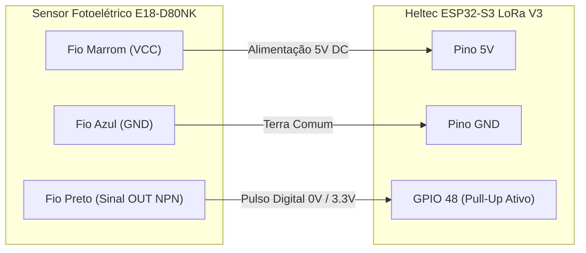

# EdgeBench: Sistema Embarcado IoT para Apontamento Automático de Produção

> **Solução Ciber-Física de Baixo Custo para Digitalização e Telemetria do Chão de Fábrica (Cenário 6)**  
> *Sensoriamento não-invasivo por barreira óptica, arquitetura de conectividade híbrida (Wi-Fi/MQTT + Rádio LoRa 915 MHz), bufferização offline de alta densidade (90+ dias), gateway mestre USB e integração analítica para PCP.*

---

## Identificação do Projeto

| Informação | Detalhes |
| :--- | :--- |
| **Título do Projeto** | **EdgeBench** — Sistema IoT Embarcado para Apontamento Automático de Produção em Postos de Trabalho Manuais |
| **Cenário de Referência** | Cenário 6 — Manufatura com bancadas de montagem manual e apontamento em pranchetas/planilhas no chão de fábrica |
| **Aplicação Principal** | Indústria 4.0, Sensoriamento Industrial Não Invasivo, Telemetria IoT e Automação de PCP (Planejamento e Controle da Produção) |
| **Equipe** | **Os Comédia** |
| **Integrantes** | • Amaro Junior Silva Luna<br>• Bruno da Silva Macedo<br>• Jonathas Levi Pascoal Palmeira<br>• Rodrigo Pinheiro Alcantara |

---

## Visão Geral do Projeto

Nas indústrias com linhas de montagem manuais, os operadores perdem frequentemente de **5% a 10% do seu tempo produtivo** registrando contagens de peças em pranchetas e formulários de papel. Esse processo tradicional gera três problemas críticos:
1. **Drenagem da capacidade produtiva** devido a constantes pausas operacionais;
2. **Erros humanos de contagem**, anotações retroativas e números imprecisos;
3. **Invisibilidade em tempo real** para o Planejamento e Controle da Produção (PCP), ocultando gargalos e paradas não programadas.

O **EdgeBench** resolve esse problema por meio de uma abordagem **100% passiva e não invasiva**: dispositivos de borda microcontrolados instalados nas calhas de escoamento das bancadas. Cada peça montada que desliza pela rampa de gravidade corta um feixe infravermelho modulado, sendo contabilizada instantaneamente por interrupção de hardware (*ISR*), com feedback visual imediato e transmissão por telemetria, sem demandar nenhuma intervenção do trabalhador.

---

## 1. Arquitetura Integral do Sistema

A arquitetura do **EdgeBench** é estruturada em três camadas integradas, segregando claramente as responsabilidades de hardware, firmware de tempo real, comunicação por radiofrequência e serviços de dados na nuvem/servidor.

### 1.1 Diagrama Geral de Arquitetura

```mermaid
flowchart TB
    subgraph CAMADA1["CAMADA 1: CHÃO DE FÁBRICA / BORDA FABRIL (NÓS DE BANCADA)"]
        direction TB
        subgraph FISICO["Elementos Físicos e Sensoriamento"]
            PECA["Peça Montada (Gravidade)"] --> CALHA["Calha de Saída"]
            CALHA --> SENSOR["Sensor E18-D80NK\n(NPN Coletor Aberto 5V)"]
            BOTAO["Botão Físico PRG (GPIO 0)\n(Curto: Sync | Longo 3s: Pareamento)"]
            LED["LED Onboard Branco (GPIO 35)\n(Feedback de Detecção e Ping)"]
        end

        subgraph HELTEC_NODE["Heltec ESP32-S3 LoRa V3 (Dual-Core @ 240MHz, 8MB Flash)"]
            direction TB
            subgraph CORE1_BOX["Core 1 (Tempo Real Estrito / IRAM)"]
                ISR_SENS["ISR de Detecção (GPIO 48)\n(Borda de Descida / IRAM_ATTR)"]
                DEBOUNCE_BOX["Debounce Dinâmico\n(10..5000 ms - Padrão 300 ms)"]
                TIMER_LED["Pulso Não-Bloqueante de LED (80ms)\n(esp_timer)"]
                FILA_PROD["Fila FreeRTOS de Eventos"]

                ISR_SENS --> DEBOUNCE_BOX --> FILA_PROD
                ISR_SENS --> TIMER_LED
            end

            subgraph CORE0_BOX["Core 0 (Operação, Comunicação e Armazenamento)"]
                TASK_DISPATCH["Task de Despacho e Controle"]
                STORAGE_MGR["Storage Manager\n(LittleFS - Buffer Binário 8B)"]
                WIFI_MQTT_MGR["Wi-Fi & MQTT Manager\n(QoS 1, Reconeção, Dreno FIFO)"]
                LORA_RX_MGR["LoRa Receiver (SX1262 @ 915MHz)\n(Beacon, OTA, Setup, Ping/Pong)"]
                NVS_MGR["NVS Manager\n(Credenciais, ID, Debounce)"]
                OTA_MGR["OTA Manager\n(Dual Partition ota_0/ota_1)"]

                FILA_PROD --> TASK_DISPATCH
                TASK_DISPATCH -->|Rede Online| WIFI_MQTT_MGR
                TASK_DISPATCH -->|Rede Offline| STORAGE_MGR
                STORAGE_MGR -->|Dreno FIFO pós-reconexão| WIFI_MQTT_MGR
            end

            FLASH_CHIP["Memória Flash SPI 8MB\n(Partições: nvs, ota_0, ota_1, storage)"]
            SX1262_NODE["Transceptor SX1262 (SPI)"]

            STORAGE_MGR <--> FLASH_CHIP
            NVS_MGR <--> FLASH_CHIP
            OTA_MGR <--> FLASH_CHIP
            LORA_RX_MGR <--> SX1262_NODE
        end

        SENSOR -->|Pulso Digital 0V / Pull-Up 3.3V| ISR_SENS
        TIMER_LED -.-> LED
        BOTAO --> HELTEC_NODE
    end

    subgraph CAMADA2["CAMADA 2: CONECTIVIDADE & GATEWAY CENTRAL"]
        direction TB
        WIFI_INFRA["Rede Wi-Fi Industrial 2.4 GHz"]
        BROKER_MQTT["Broker MQTT: Mosquitto / EMQX\n(fabrica/bancada_+/producao)"]

        subgraph CENTRAL_GW["Central Gateway (Heltec ESP32-S3 LoRa USB)"]
            SX1262_GW["Transceptor SX1262 (915 MHz)"]
            LORA_TX_GW["LoRa Transmitter & RX Listener"]
            SERIAL_BRIDGE["Serial Bridge (UART JSON Bidirecional)"]
            
            SX1262_GW <--> LORA_TX_GW <--> SERIAL_BRIDGE
        end

        WIFI_MQTT_MGR -->|Publicação MQTT QoS 1| WIFI_INFRA --> BROKER_MQTT
        SX1262_NODE <-.->|LoRa 915 MHz (Beacon, Config, Ping/Pong, Telemetria)| SX1262_GW
    end

    subgraph CAMADA3["CAMADA 3: INFRAESTRUTURA CENTRAL, BACKEND & ANALYTICS"]
        direction TB
        subgraph SERVER["Estação de Trabalho / Servidor Local (PCP)"]
            CLI_TOOL["app/uart_serial.py (CLI & Gateway Driver)\n(Ping Broadcast, Pareamento, Setup, OTA HTTP Server)"]
            MQTT_SERVICE["app/mqtt_listener.py\n(Ingestão Contínua, Idempotência)"]
            DATABASE[("Banco de Dados Relacional\n(SQLite / PostgreSQL - SQLAlchemy)")]
            ANALYTICS["app/analytics.py & scheduler.py\n(Métricas OEE, Peças/Hora, Turnos)"]
            EXCEL["app/excel_generator.py\n(Relatórios Executivos .XLSX)"]
            CLOUD_SYNC["app/google_sheets_sync.py\n(Sincronização em Nuvem)"]

            SERIAL_BRIDGE <-->|USB / VCP (Comandos JSON)| CLI_TOOL
            BROKER_MQTT -->|Subscrição MQTT| MQTT_SERVICE
            MQTT_SERVICE --> DATABASE
            DATABASE --> ANALYTICS --> EXCEL
            DATABASE --> CLOUD_SYNC
        end
    end
```

---

## 2. Componentes de Hardware e Pinagem

O projeto adota o kit **Heltec WiFi LoRa 32 V3** (baseado no SoC **ESP32-S3FN8**), integrando microcontrolador dual-core, conectividade Wi-Fi, rádio LoRa de longo alcance e suporte a periféricos industriais.

### 2.1 Mapeamento de Pinos da Bancada (Nó de Borda)

| Periférico / Função | Pino no ESP32-S3 | Modo / Nível Lógico | Descrição Técnica |
| :--- | :---: | :--- | :--- |
| **Sensor E18-D80NK (Sinal OUT)** | **GPIO 48** | Entrada com Pull-up interno | Saída NPN coletor aberto (0V na detecção da peça, 3.3V em repouso). |
| **LED Indicador Onboard** | **GPIO 35** | Saída Digital (Ativo Alto) | Feedback visual imediato de passagem de peça (pulso 80ms) e Ping Broadcast (150ms). |
| **Botão Físico PRG Onboard** | **GPIO 0** | Entrada com Pull-up interno | Toque curto (<1.5s): sync de hora/config; Toque longo (>3s): anúncio de pareamento. |
| **Alimentação do Sensor (VCC)** | **5V / VBUS** | 5V DC | Alimentação positiva do sensor fotoelétrico. |
| **Referência de Terra (GND)** | **GND** | 0V | Terra comum entre fonte, sensor e microcontrolador. |
| **LoRa SX1262 NSS** | **GPIO 8** | Saída SPI (Chip Select) | Seleção do chip LoRa via barramento SPI dedicado. |
| **LoRa SX1262 SCK** | **GPIO 9** | Saída SPI (Clock) | Sinal de clock do barramento SPI (até 10 MHz). |
| **LoRa SX1262 MOSI** | **GPIO 10** | Saída SPI (Master Out) | Linha de dados do mestre para o transceptor. |
| **LoRa SX1262 MISO** | **GPIO 11** | Entrada SPI (Master In) | Linha de dados do transceptor para o mestre. |
| **LoRa SX1262 RST** | **GPIO 12** | Saída Digital | Reset de hardware do SX1262. |
| **LoRa SX1262 BUSY** | **GPIO 13** | Entrada Digital | Sinal de ocupado do rádio (indica prontidão para comandos SPI). |
| **LoRa SX1262 DIO1** | **GPIO 14** | Entrada com Interrupção | Interrupção externa disparada ao concluir recepção/transmissão RF. |
| **LoRa VEXT Control** | **GPIO 36** | Saída Digital (Ativo Baixo) | Chaveamento de alimentação dos periféricos onboard da Heltec. |

### 2.2 Conexão Elétrica do Sensor Fotoelétrico E18-D80NK



> **Nota de Proteção Elétrica:** O sensor E18-D80NK possui saída NPN em coletor aberto. O pull-up interno do ESP32 (`GPIO_PULLUP_ENABLE`) mantém a linha em **3.3V** em repouso. Ao detectar a peça, o transistor interno do sensor conecta o pino ao terra (**0V**), gerando borda de descida perfeitamente segura e imune a sobretensão.

---

## 3. Protocolo de Comunicação LoRa (EdgeBench RF)

Nas fábricas, quedas de Wi-Fi e panes elétricas podem ocorrer simultaneamente. O **EdgeBench** implementa um protocolo ponto-multiponto determinístico sobre rádio LoRa (915 MHz, SF7, BW 125 kHz, CR 4/5) para diagnóstico, sincronização, reconfiguração remota e telemetria de fallback.

### 3.1 Formato Geral do Pacote

Todos os pacotes LoRa possuem o byte identificador do projeto `0xEB` no cabeçalho:

| Byte 0 | Byte 1 | Bytes 2..N |
| :---: | :---: | :--- |
| `0xEB` *(Identificador)* | `Msg Type` *(Opcode)* | *Payload específico do comando/resposta* |

### 3.2 Tabela de Opcodes e Estrutura dos Pacotes

| Opcode | Mnemônico | Direção | Descrição / Payload |
| :---: | :--- | :---: | :--- |
| `0x10` | `LORA_MSG_REQ_TIME` | Nó ➔ Central | Solicita sincronização temporal: `[0xEB, 0x10, MAC(6B), BENCH_ID(2B)]` |
| `0x11` | `LORA_MSG_RESP_TIME` | Central ➔ Nó | Resposta/Beacon de horário: `[0xEB, 0x11, TARGET_MAC(6B), EPOCH(8B)]` |
| `0x20` | `LORA_MSG_REQ_CONFIG` | Nó ➔ Central | Solicita credenciais: `[0xEB, 0x20, MAC(6B), BENCH_ID(2B)]` |
| `0x21` | `LORA_MSG_RESP_CONFIG` | Central ➔ Nó | Envia SSID, senha e broker: `[0xEB, 0x21, MAC(6B), TOKEN(4B), SSID_LEN, SSID, PASS_LEN, PASS, BROKER_LEN, BROKER]` |
| `0x30` | `LORA_MSG_CMD_SET_BENCH` | Central ➔ Nó | Configura ID da bancada: `[0xEB, 0x30, TARGET_MAC(6B), TARGET_ID(2B), TOKEN(4B), NEW_ID(2B)]` |
| `0x31` | `LORA_MSG_REQ_BENCH_INFO`| Central ➔ Nó | Consulta endereço MAC de uma bancada: `[0xEB, 0x31, TARGET_ID(2B)]` |
| `0x32` | `LORA_MSG_RESP_BENCH_INFO`| Nó ➔ Central | Responde identificação: `[0xEB, 0x32, MAC(6B), BENCH_ID(2B)]` |
| `0x33` | `LORA_MSG_ANNOUNCE_PAIRING`| Nó ➔ Central | Anúncio de pareamento físico pelo botão: `[0xEB, 0x33, MAC(6B), BENCH_ID(2B)]` |
| `0x40` | `LORA_MSG_CMD_OTA` | Central ➔ Nó | Comanda início de OTA: `[0xEB, 0x40, TARGET_ID(2B), TOKEN(4B), URL_LEN, URL]` |
| `0x50` | `LORA_MSG_TELEMETRY` | Nó ➔ Central | Telemetria de fallback offline: `[0xEB, 0x50, MAC(6B), BENCH_ID(2B), COUNT(4B), TIMESTAMP(8B)]` |
| `0x60` | `LORA_MSG_CMD_SET_DEBOUNCE`| Central ➔ Nó | Configura debounce em ms: `[0xEB, 0x60, TARGET_MAC(6B), TARGET_ID(2B), TOKEN(4B), DEBOUNCE_MS(4B)]` |
| `0x70` | `LORA_MSG_CMD_PING` | Central ➔ Broadcast | Disparo de Ping para descobrir bancadas online: `[0xEB, 0x70, TOKEN(4B)]` |
| `0x71` | `LORA_MSG_RESP_PONG` | Nó ➔ Central | Resposta individual de presença: `[0xEB, 0x71, MAC(6B), BENCH_ID(2B)]` |

* **Token de Segurança:** Comandos críticos exigem o token `0xABCD1234` para rejeitar pacotes espúrios ou ruídos de RF.

### 3.3 Regras de Endereçamento e Prevenção de Colisão

1. **Broadcast (`FF:FF:FF:FF:FF:FF`):** Utilizado para sincronização de horário (`RESP_TIME`), credenciais Wi-Fi globais (`RESP_CONFIG`) e descoberta (`CMD_PING`).
2. **Proteção Rigorosa de Setup (`ID == 0`):** Uma bancada recém-gravada inicia com ID `0` (*Não Configurada*). Para evitar que duas placas novas recebam o mesmo ID acidentalmente por broadcast, **uma bancada com ID 0 rejeita expressamente broadcasts de configuração** (`CMD_SET_BENCH`). Ela exige que o comando contenha seu endereço MAC individual específico.
3. **Anti-Collision Jitter no Ping Broadcast:** Ao receber `CMD_PING` (0x70), para impedir que múltiplos nós transmitam ao mesmo tempo destruindo pacotes no ar (colisão ALOHA), cada bancada calcula um atraso pseudo-aleatório (`50ms a 1200ms` via `esp_random()`) antes de responder com `RESP_PONG`, garantindo que todas as bancadas sejam ouvidas pela Central.

---

## 4. Recursos de Firmware e Usabilidade em Campo

### 4.1 Botão Físico Multifunção (PRG - GPIO 0)
Permite comissionar e configurar bancadas no chão de fábrica sem computador ou cabo USB:
* **Toque Curto (< 1.5s):** A bancada transmite `REQ_TIME` e `REQ_CONFIG` via LoRa, solicitando imediatamente horário e credenciais da rede para a Central.
* **Toque Longo (> 3s):** A bancada entra em modo de pareamento e emite `ANNOUNCE_PAIRING` (0x33). O operador na estação central vê o MAC e o ID no menu interativo do CLI e define o novo ID numerico da bancada na hora.

### 4.2 Feedback Visual Não-Bloqueante (LED - GPIO 35)
* **Passagem de Peça:** Dispara um pulso luminoso de **80 ms** acionado via `esp_timer` no Core 1, dando certeza ao operador de que o sensor registrou a contagem.
* **Ping Broadcast:** Pisca por **150 ms** indicando que a placa recebeu a sondagem de rádio da Central.

### 4.3 Debounce Dinâmico em Memória Não-Volátil (NVS)
O tempo de debounce do sensor óptico pode ser ajustado de **10 ms a 5000 ms** remotamente via LoRa (`CMD_SET_DEBOUNCE`), sem necessidade de recompilar ou reiniciar o firmware. O novo valor é aplicado dinamicamente na ISR e gravado na NVS.

### 4.4 Atualização Remota de Firmware (OTA)
O particionamento da Flash conta com duas áreas de aplicação (`ota_0` e `ota_1`) de 1.5 MB cada e controle de rollback automático. O processo pode ser disparado tanto por comando LoRa (`CMD_OTA`) quanto pelo tópico MQTT `fabrica/bancada_<id>/ota`, realizando o download HTTP com validação SHA-256 e confirmação de inicialização bem-sucedida.

---

## 5. Estrutura e Organização do Repositório

```
EdgeBench/
├── README.md                                  # Guia mestre de arquitetura, protocolo e instruções (este documento)
├── LICENSE                                    # Licença de uso do código-fonte
├── firmware/                                  # Firmware do Nó de Borda Fabril (ESP32-S3 de Bancada)
│   ├── CMakeLists.txt                         # Script de compilação do projeto da bancada
│   ├── partitions.csv                         # Particionamento: nvs, otadata, ota_0, ota_1, storage (LittleFS)
│   ├── sdkconfig.defaults                     # Configurações do SDK (FreeRTOS dual-core, clock 240MHz)
│   └── main/
│       ├── app_main.c                         # Ponto de entrada, orquestração e inicialização dos subsistemas
│       ├── sensor_manager.c/.h                # ISR no Core 1, debounce dinâmico e feedback no LED GPIO 35
│       ├── storage_manager.c/.h               # Buffer binário não-volátil (LittleFS, 8 bytes por registro)
│       ├── nvs_manager.c/.h                   # Gerenciamento NVS (Wi-Fi, Broker, Bench ID, Debounce)
│       ├── wifi_manager.c/.h                  # Pilha Wi-Fi com reconexão automática e reconfiguração dinâmica
│       ├── mqtt_manager.c/.h                  # Cliente MQTT QoS 1, tópicos dinâmicos e dreno FIFO pós-queda
│       ├── lora_receiver.c/.h                 # Transceptor SX1262 SPI, parser de pacotes, Ping/Pong, Beacon e OTA
│       ├── button_manager.c/.h                # Tratamento do botão PRG (toque curto e anúncio de pareamento 3s)
│       ├── ota_manager.c/.h                   # Motor de download OTA HTTP com rollback de segurança
│       └── Kconfig.projbuild                  # Configurações padrão via menuconfig
├── firmware_central/                          # Firmware do Gateway Central Mestre USB (ESP32-S3)
│   ├── CMakeLists.txt                         # Script de compilação do Gateway Central
│   ├── partitions.csv                         # Particionamento da Flash da Central
│   └── main/
│       ├── main.c                             # Ponto de entrada da Central
│       ├── lora_transmitter.c/.h              # Transmissor e receptor contínuo LoRa SX1262
│       ├── serial_bridge.c/.h                 # Ponte serial UART bidirecional (Parser JSON <-> Comandos LoRa)
│       └── nvs_config.c/.h                    # Persistência de credenciais mestres de Wi-Fi e Broker
├── app/                                       # Backend de Ingestão, Painel Serial e Analítica (Python)
│   ├── uart_serial.py                         # Painel interativo CLI (Ping Broadcast, Pareamento, OTA Server)
│   ├── main.py                                # Ponto de entrada consolidado dos serviços Python
│   ├── mqtt_listener.py                       # Ingestor MQTT multithread com prevenção de duplicatas
│   ├── database.py / models.py                # Camada ORM (SQLAlchemy) e modelos relacionais
│   ├── excel_generator.py                     # Geração automatizada de planilhas executivas (.xlsx) por turno
│   ├── analytics.py                           # Cálculo de indicadores industriais (peças/hora, OEE, paradas)
│   ├── google_sheets_sync.py                  # Sincronização de apontamentos em nuvem (Google Sheets)
│   ├── scheduler.py                           # Agendador de relatórios e fechamentos de turno fabril
│   ├── docker-compose.yml                     # Subida rápida de Mosquitto, PostgreSQL e Ingestor
│   └── Dockerfile                             # Contêiner do backend de dados
└── requisitos/
    └── especificacao_tecnica.md               # Especificação aprofundada: RFs, RNFs, análise mecânica e cinemática
```

### Rastreabilidade de Módulos e Funcionalidades

| Módulo da Arquitetura | Arquivo Principal | Função Central |
| :--- | :--- | :--- |
| **Sensoriamento & Debounce** | [`firmware/main/sensor_manager.c`](firmware/main/sensor_manager.c) | Contagem atômica na ISR, debounce dinâmico, pulso do LED GPIO 35. |
| **Armazenamento Offline** | [`firmware/main/storage_manager.c`](firmware/main/storage_manager.c) | Buffer binário de 8 bytes na partição LittleFS (90+ dias de autonomia). |
| **Protocolo LoRa das Bancadas** | [`firmware/main/lora_receiver.c`](firmware/main/lora_receiver.c) | Recepção de Beacons, pareamento, Ping/Pong e atualização OTA. |
| **Botão de Setup Rápido** | [`firmware/main/button_manager.c`](firmware/main/button_manager.c) | Toque curto (<1.5s) e toque longo (>3s) para anúncio de pareamento. |
| **Gateway Mestre LoRa** | [`firmware_central/main/lora_transmitter.c`](firmware_central/main/lora_transmitter.c) | Transmissão de comandos de rádio e escuta RX contínua na Central. |
| **Ponte Serial UART** | [`firmware_central/main/serial_bridge.c`](firmware_central/main/serial_bridge.c) | Tradução bidirecional entre comandos JSON serial e pacotes RF. |
| **Painel Serial & Driver** | [`app/uart_serial.py`](app/uart_serial.py) | Menu com 11 funções (Ping Broadcast, Pareamento, Servidor HTTP OTA). |
| **Ingestor de Telemetria** | [`app/mqtt_listener.py`](app/mqtt_listener.py) | Ingestão MQTT com chave única `(bench_id, timestamp)` para idempotência. |

---

## 6. Guia de Compilação, Gravação e Uso

### 6.1 Compilação do Firmware das Bancadas (`firmware`)

1. Abra o terminal configurado com o ESP-IDF v5.x (ou PowerShell do ESP-IDF):
   ```powershell
   & "C:\Espressif\tools\Microsoft.v5.5.5.PowerShell_profile.ps1"
   ```
2. Navegue até o diretório do firmware e compile:
   ```bash
   cd firmware
   idf.py set-target esp32s3
   idf.py build
   ```
3. Conecte a placa da bancada via USB e grave:
   ```bash
   idf.py -p COM_PORT flash monitor
   ```

### 6.2 Compilação do Firmware da Central Gateway (`firmware_central`)

1. No mesmo ambiente ESP-IDF:
   ```bash
   cd firmware_central
   idf.py set-target esp32s3
   idf.py build
   ```
2. Conecte o ESP32 da Central via USB e grave:
   ```bash
   idf.py -p COM_PORT flash monitor
   ```

### 6.3 Utilização do Painel Serial CLI (`app/uart_serial.py`)

Com o ESP32 Central conectado na USB do computador:

```bash
cd app
python -m venv venv
.\venv\Scripts\activate
pip install -r requirements.txt
python uart_serial.py
```

O menu interativo será exibido no terminal:

```
============================================================
    EdgeBench - Painel Serial Central
============================================================

Selecione uma operacao:
  [1] Testar conexao com Gateway (Ping local)
  [2] Ping Broadcast LoRa (Descobrir todas as bancadas online: MAC e ID)
  [3] Sincronizar Horario do PC (Emitir Beacon de Horario)
  [4] Reconfigurar Wi-Fi das bancadas via LoRa
  [5] Reconfigurar Broker MQTT das bancadas via LoRa
  [6] Reconfigurar ID de Bancada via LoRa (identificando pelo ID atual)
  [7] Consultar MAC de uma Bancada via LoRa
  [8] Monitorar logs contínuos da Serial
  [9] Modo de Pareamento Rápido (Aguardando botão físico da bancada...)
  [10] Gerenciar Atualização OTA de Firmware (Servidor Local / LoRa / MQTT)
  [11] Reconfigurar Tempo de Debounce do Sensor via LoRa
  [0] Sair
```

* **Opção [2] (Ping Broadcast):** A Central envia o comando `0x70` via rádio; todas as bancadas no raio de alcance piscam o LED, aguardam o jitter anti-colisão e respondem. O script exibe a tabela em tempo real com o status de cada nó.
* **Opção [9] (Modo Pareamento Rápido):** Coloca a Central em escuta. Basta pressionar o botão PRG da bancada por 3 segundos para que o computador detecte a placa e permita definir seu novo ID na hora.
* **Opção [10] (OTA):** Inicia um servidor HTTP local temporário na máquina e comanda as bancadas via rádio ou MQTT para baixarem o binário compilado.

### 6.4 Inicialização dos Serviços de Backend (Docker Compose)

Para rodar o Broker Mosquitto e a stack analítica com banco de dados em contêineres:

```bash
cd app
docker-compose up -d
```

---

## 7. Principais Diferenciais de Engenharia

1. **Salvamento Local (Offline-First):** Em caso de falha de infraestrutura de rede, o nó armazena os registros em memória Flash não volátil com particionamento LittleFS e proteção contra desligamentos abruptos de energia.
2. **Buffer Binário de Alta Densidade (8 Bytes):** Cada registro de produção consome apenas 8 bytes (`count` + `timestamp`), comportando mais de **131.000 eventos** em apenas 1 MB de Flash (mais de **90 dias de autonomia** contínua sem Wi-Fi).
3. **Pilha Dual-Core Segregada:**
   * **Core 1:** Exclusivo para tempo real crítico (ISR do sensor óptico, debounce temporal e pulso do LED).
   * **Core 0:** Gerenciamento das pilhas de rede Wi-Fi, cliente MQTT, rádio LoRa e operações de Flash.
4. **Resiliência Máxima por LoRa 915 MHz:** Recuperação de horário absoluto, reconfiguração remota e telemetria de emergência mesmo durante apagões simultâneos de rede na fábrica.
5. **Comissionamento Zero-Config:** Identificação inicial por anúncio físico de botão (3 segundos) e descoberta por Ping Broadcast com anti-colisão no ar.

---

## 8. Documentação Complementar

Para consultar os requisitos detalhados de engenharia, especificações funcionais e não-funcionais (RFs/RNFs), análise cinemática da rampa de peças e comparativo técnico entre IoT e Visão Computacional, consulte:

📄 **[especificacao_tecnica.md](requisitos/especificacao_tecnica.md)**
