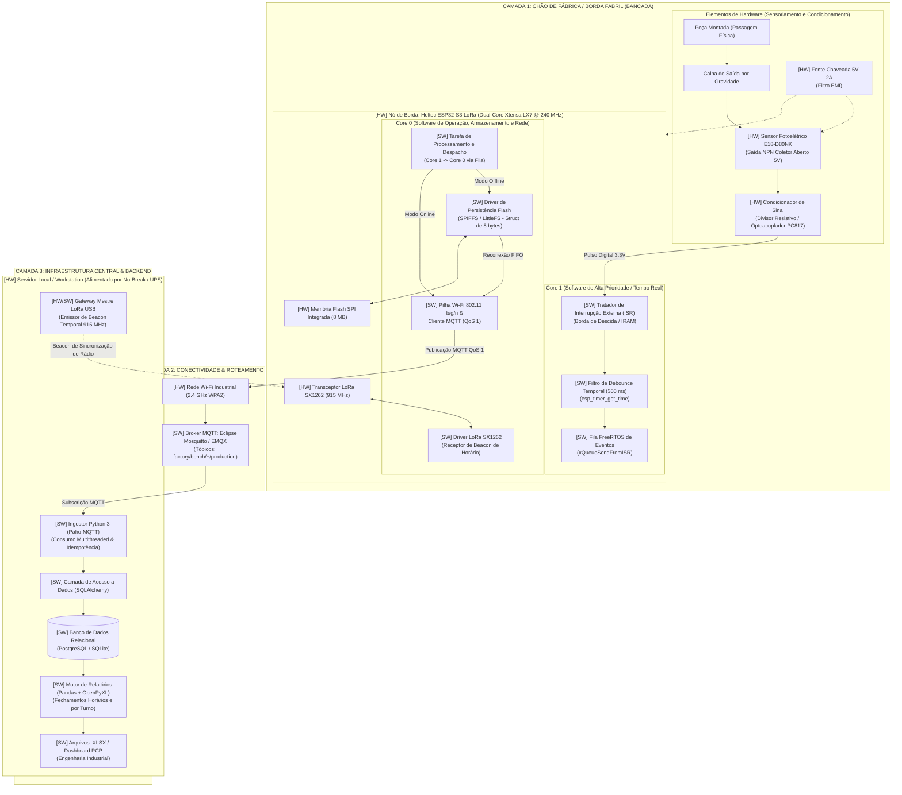
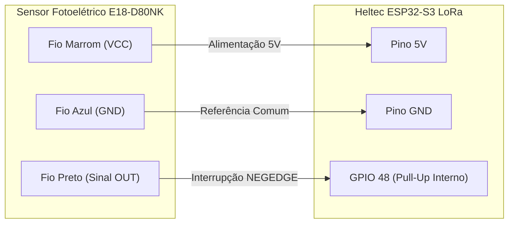

# EdgeBench: Sistema Embarcado IoT para Apontamento Automático de Produção

> **Solução Ciber-Física de Baixo Custo para Digitalização do Chão de Fábrica (Cenário 6)**  
> *Sensoriamento não-invasivo por barreira óptica, persistência offline de alta densidade (90+ dias) e telemetria industrial resiliente via MQTT.*

---

## Identificação do Projeto

| Informação | Detalhes |
| :--- | :--- |
| **Título do Projeto** | **EdgeBench** — Sistema IoT Embarcado para Apontamento Automático de Produção em Postos de Trabalho Manuais |
| **Cenário de Referência** | Cenário 6 — Manufatura com bancadas de montagem manual e apontamento em pranchetas/planilhas no chão de fábrica |
| **Aplicação Principal** | Indústria 4.0, Sensoriamento Industrial Não Invasivo, Telemetria IoT e Automação de PCP (Planejamento e Controle da Produção) |
| **Equipe** | **Os Comédia** |
| **Integrantes** | • Amaro Junior Silva Luna<br>• Bruno da Silva Macedo<br>• Jonathas Levi Pascoal Palmeira<br>• Rodrigo Pinheiro Alcantara |

---

## Visão Geral do Projeto

Nas indústrias com linhas de montagem manuais, os operadores perdem frequentemente de **5% a 10% do seu tempo útil** registrando contagens de peças em pranchetas e formulários de papel. Esse processo tradicional gera três problemas críticos:
1. **Drenagem da capacidade produtiva** devido a constantes pausas operacionais;
2. **Erros humanos de contagem**, anotações retroativas e números aproximados;
3. **Invisibilidade em tempo real** para o Planejamento e Controle da Produção (PCP), ocultando gargalos e paradas não programadas.

O **EdgeBench** resolve esse problema por meio de uma abordagem **100% passiva e não invasiva**: um dispositivo de borda microcontrolado instalado na calha de escoamento de cada bancada. Cada peça montada que desliza pela rampa de gravidade corta um feixe infravermelho modulado, sendo contabilizada instantaneamente por interrupção de hardware (*ISR*), sem demandar nenhuma intervenção do trabalhador.

---

## 1. Arquitetura do Sistema e Diagrama de Blocos

A arquitetura do **EdgeBench** é estruturada em três camadas integradas (Borda Fabril, Mensageria/Rede e Infraestrutura Central), segregando claramente as responsabilidades de hardware e software para atingir determinismo temporal e alta resiliência.

### 1.1 Diagrama de Blocos Preliminar



### 1.2 Relações e Fluxo de Dados e Controle entre Elementos

1. **Detecção Física e Condicionamento (Hardware):** A peça liberada desliza pela calha e interrompe o feixe infravermelho do sensor `E18-D80NK`. A saída digital NPN transiciona para nível baixo e é compatibilizada em 3.3V pelo condicionador de sinal antes de atingir o GPIO do microcontrolador.
2. **Tratamento de Borda e Debounce (Software - Core 1):** A borda de descida dispara imediatamente a `ISR` alocada na memória rápida IRAM do Core 1. O algoritmo temporal rejeita repiques com janela de 300 ms (`esp_timer_get_time()`) e posta o evento na fila FreeRTOS sem chamadas bloqueantes.
3. **Persistência Binária e Despacho (Software - Core 0):** A tarefa operacional no Core 0 consome o evento. Se o Wi-Fi e o Broker estiverem disponíveis, serializa o registro e despacha via MQTT. Se houver queda de conexão, grava a estrutura compacta de 8 bytes (`count` + `timestamp`) na partição não volátil (SPIFFS / LittleFS).
4. **Sincronização de Horário Resiliente:** Em operação normal, o microcontrolador sincroniza o relógio via SNTP. Em caso de quedas de energia simultâneas à indisponibilidade de rede, o rádio LoRa escuta o *Beacon* emitido pelo Gateway Central USB conectado ao servidor ininterrupto, restaurando a data/hora absoluta sem necessidade de baterias descartáveis.
5. **Ingestão, Idempotência e Consolidação (Software Central):** O serviço em Python consome os tópicos MQTT com QoS 1, valida a chave única `(bancada_id, timestamp)` via SQLAlchemy para evitar duplicatas e persiste no banco de dados. Periodicamente, o script gera as planilhas consolidadas `.xlsx` por turno fabril (06h-14h, 14h-22h, 22h-06h).

### 1.3 Conexão Elétrica: ESP32-S3 e Sensor Fotoelétrico E18-D80NK

Diagrama direto de ligação entre o microcontrolador Heltec ESP32-S3 e o sensor de passagem E18-D80NK:



#### Mapeamento de Pinos e Fiação

| Fio do Sensor E18-D80NK | Pino no ESP32-S3 | Descrição / Nível Lógico |
| :--- | :--- | :--- |
| **Marrom (VCC)** | **5V** | Alimentação positiva do sensor (5V DC) |
| **Azul (GND)** | **GND** | Referência de terra comum |
| **Preto (OUT)** | **GPIO 48** | Sinal digital NPN em coletor aberto (ativo em nível baixo `0V` na passagem da peça) |

> **Nota de Proteção Elétrica:** O sensor E18-D80NK possui saída NPN em coletor aberto (atua chaveando para o terra). Com a ativação do pull-up interno do ESP32 (`GPIO_PULLUP_ENABLE`), a tensão no GPIO 48 varia com segurança estritamente entre **0V** (feixe cortado / peça detectada) e **3.3V** (em repouso), sem risco de sobretensão no microcontrolador.

---


## 2. Dependências e Recursos do Projeto

A tabela a seguir discrimina todas as dependências previstas para o ecossistema do **EdgeBench**, categorizadas por tipo, ambiente e finalidade técnica:

### 2.1 Plataformas e Ambientes de Execução

| Plataforma / Ambiente | Versão Mínima | Função no Projeto |
| :--- | :--- | :--- |
| **ESP-IDF (Espressif IoT Development Framework)** | `v5.0+` (Recomendado `v5.5.x`) | Framework oficial para compilação, flashing e configuração de periféricos do ESP32-S3. |
| **FreeRTOS (Kernel SMP nativo ESP-IDF)** | `v10.x` | Sistema operacional de tempo real multitarefa com suporte a múltiplos núcleos. |
| **Python** | `3.10+` | Interpretador para execução do serviço de ingestão, persistência e geração de planilhas. |
| **Eclipse Mosquitto / EMQX** | `2.0+` | Broker de mensageria MQTT executado localmente ou em contêiner Docker. |
| **Host de Desenvolvimento** | Windows 10/11 ou Ubuntu 22.04 LTS | Ambiente de compilação, monitoramento serial e execução dos serviços de apoio. |

### 2.2 Bibliotecas e Componentes de Software

#### A. Firmware Embarcado (C / ESP-IDF)
* `driver/gpio.h` e `esp_timer.h`: Configuração de pinos com interrupção externa e temporizador de precisão de microssegundos para debounce.
* `freertos/FreeRTOS.h`, `freertos/queue.h`, `freertos/task.h`: Filas thread-safe para comunicação entre ISR e tarefas nos Cores 0 e 1.
* `esp_spiffs.h` / `esp_littlefs.h`: Sistema de arquivos não volátil com *wear leveling* e proteção contra desligamento abrupto de energia.
* `mqtt_client.h` (`esp-mqtt`): Cliente MQTT nativo com suporte a reconexão automática, QoS 1 e MQTT v3.1.1 / v5.0.
* `esp_wifi.h`, `esp_event.h`, `esp_netif.h`: Pilha de rede TCP/IP e gerenciador de eventos de conectividade Wi-Fi.
* `esp_netif_sntp.h`: Cliente de sincronização de relógio de rede via servidores NTP (ex.: `a.st1.ntp.br`).

#### B. Backend de Ingestão e Processamento (Python)
* `paho-mqtt` (`>= 1.6.1`): Cliente MQTT para subscrição multithreaded nos tópicos das bancadas.
* `SQLAlchemy` (`>= 2.0.0`): Camada ORM para persistência relacional com controle de transações e idempotência.
* `pandas` (`>= 2.0.0`): Manipulação tabular de séries temporais de produção e cálculo de métricas agregadas por hora e turno.
* `openpyxl` (`>= 3.1.0`): Formatação visual e geração automatizada dos arquivos executivos de planilha `.xlsx`.

### 2.3 Ferramentas de Desenvolvimento e Build

* `idf.py`: Utilitário de linha de comando baseado em CMake e Ninja para gerenciar alvos, compilação e gravação da Flash.
* `xtensa-esp32s3-elf-gcc`: Toolchain de compilação cruzada oficial da Espressif para a arquitetura Xtensa LX7.
* `git`: Controle de versionamento do código-fonte e documentação.
* `pip` e `virtualenv`: Gerenciamento isolado das dependências do ecossistema Python.

### 2.4 Recursos de Hardware

* **Nó de Borda:** Placa de desenvolvimento **Heltec ESP32-S3 LoRa** (Dual-Core 240 MHz, transceptor SX1262 915 MHz, Wi-Fi 2.4 GHz, BLE 5).
* **Sensoriamento:** **Sensor Fotoelétrico E18-D80NK** (Infravermelho difuso ajustável de 3 a 80 cm, saída NPN coletor aberto 5V).
* **Condicionador de Sinal:** Divisor de tensão resistivo (3.3 kΩ / 2.2 kΩ) ou módulo optoacoplador **PC817** para isolamento galvânico e proteção do GPIO.
* **Alimentação de Bancada:** Fonte chaveada industrial 5V DC 2A Bivolt com filtro EMI contra transientes de rede.
* **Infraestrutura Central:** Servidor/PC do PCP conectado a No-Break (UPS) e nó Heltec USB atuando como Gateway Mestre LoRa.

---

## 3. Organização do Repositório e Mapeamento dos Arquivos

A estrutura do projeto está organizada de modo que cada tópico do sistema e componente da arquitetura corresponda a arquivos diretamente localizáveis no repositório:

```
EdgeBench/
├── README.md                                  # Guia executivo, arquitetura e instruções do projeto (este arquivo)
├── LICENSE                                    # Licença de uso do código-fonte (Apache 2.0 / MIT)
├── firmware/                                  # Componente de Software: Firmware Embarcado (ESP-IDF)
│   ├── CMakeLists.txt                         # Script de compilação principal do projeto ESP-IDF
│   ├── partitions.csv                         # Tabela de particionamento da memória Flash (área SPIFFS de 1 MB)
│   ├── sdkconfig.defaults                     # Configurações base do SDK (FreeRTOS, clock, alocação de memória)
│   └── main/                                  # Código-fonte principal do dispositivo de borda
│       ├── CMakeLists.txt                     # Registro de arquivos-fonte e dependências do componente main
│       ├── Kconfig.projbuild                  # Interface menuconfig para configuração de Wi-Fi, MQTT e pinos
│       └── app_main.c                         # Implementação central: ISR, Debounce, filas, SPIFFS e MQTT
└── requisitos/                                # Componente de Documentação de Engenharia
    └── especificacao_tecnica.md               # DOCUMENTO MESTRE: Requisitos RF/RNF/RN, Escopo,
                                               #   Levantamento Técnico, IoT vs Visão Computacional,
                                               #   Análise Físico-Mecânica e Visão Crítica Fabril
```

### Rastreabilidade entre Arquitetura e Arquivos do Projeto

| Tópico / Módulo da Arquitetura | Elemento Representado | Arquivo no Repositório | Descrição |
| :--- | :--- | :--- | :--- |
| **ISR e Debounce de Sensor** | Core 1 (Software) | [`firmware/main/app_main.c`](firmware/main/app_main.c) | `sensor_gpio_isr_handler()` e temporização de 300 ms via `esp_timer`. |
| **Persistência Offline Local** | Core 0 / Flash SPI | [`firmware/main/app_main.c`](firmware/main/app_main.c) | `init_spiffs()` e rotina de escrita/leitura da struct `sensor_data_record_t`. |
| **Particionamento da Memória** | Memória Flash (HW/SW) | [`firmware/partitions.csv`](firmware/partitions.csv) | Definição da partição `spiffs` de armazenamento offline resiliente. |
| **Conectividade Wi-Fi e MQTT** | Core 0 / Mensageria | [`firmware/main/app_main.c`](firmware/main/app_main.c) | Inicialização da pilha Wi-Fi, cliente SNTP e despachante MQTT QoS 1. |
| **Parâmetros de Configuração** | Parâmetros de Borda | [`firmware/main/Kconfig.projbuild`](firmware/main/Kconfig.projbuild) | Configuração via terminal dos pinos do sensor e credenciais de rede. |
| **Especificação de Requisitos** | Documentação Mestre | [`requisitos/especificacao_tecnica.md`](requisitos/especificacao_tecnica.md) | Detalhamento integral de RFs, RNFs, Regras de Negócio e análise física. |

---

## 4. Guia de Preparação, Instalação e Configuração

Os passos a seguir descrevem a preparação do ambiente, correspondendo fielmente às dependências listadas e aos elementos de arquitetura projetados:

### 4.1 Pré-requisitos e Instalação de Ferramentas

1. **Instalar o ESP-IDF v5.x:**
   Siga o guia oficial de instalação da Espressif para a sua plataforma ([Guia de Instalação ESP-IDF](https://docs.espressif.com/projects/esp-idf/en/latest/esp32s3/get-started/)).
2. **Carregar as variáveis de ambiente no terminal:**
   * **Linux/macOS:**
     ```bash
     . $HOME/esp/esp-idf/export.sh
     ```
   * **Windows (PowerShell):**
     ```powershell
     . $env:USERPROFILE\esp\esp-idf\export.ps1
     ```

### 4.2 Configuração, Compilação e Gravação do Firmware (Nó de Borda)

1. **Navegar até o diretório do firmware:**
   ```bash
   cd firmware
   ```
2. **Definir o microcontrolador alvo (ESP32-S3):**
   ```bash
   idf.py set-target esp32s3
   ```
3. **Configurar as credenciais de rede e pinagem via Menuconfig:**
   ```bash
   idf.py menuconfig
   ```
   * Em `Example Connection Configuration`, defina o SSID e senha do Wi-Fi industrial.
   * Em `Component config -> ESP-MQTT Configuration`, configure o endereço do Broker MQTT (ex.: `mqtt://192.168.1.100:1883`).
   * Salve e saia do menu interativo.
4. **Compilar o projeto:**
   ```bash
   idf.py build
   ```
5. **Gravar na placa Heltec ESP32-S3 e abrir o monitor serial:**
   ```bash
   # Substitua COMx pela porta correspondente no Windows ou /dev/ttyUSBx no Linux
   idf.py -p COMx flash monitor
   ```

### 4.3 Inicialização do Broker MQTT (Eclipse Mosquitto)

Em ambiente local ou servidor central, inicie o broker MQTT via Docker ou instalação nativa:

```bash
# Execução simplificada via Docker na porta padrão 1883
docker run -d --name mosquitto -p 1883:1883 -p 9001:9001 eclipse-mosquitto:2.0
```

### 4.4 Preparação e Execução do Backend de Ingestão (Python)

1. **Criar e ativar o ambiente virtual na estação servidora:**
   ```bash
   python -m venv venv
   # No Windows:
   .\venv\Scripts\activate
   # No Linux/macOS:
   source venv/bin/activate
   ```
2. **Instalar as bibliotecas requeridas:**
   ```bash
   pip install paho-mqtt sqlalchemy pandas openpyxl
   ```
3. **Executar o serviço de ingestão e consolidação:**
   O serviço subscreverá nos tópicos `factory/bench/+/production`, gravando os apontamentos em banco e gerando periodicamente as planilhas consolidadas `.xlsx` nas pastas de rede do PCP.

---

## 5. Principais Diferenciais de Engenharia

* **Salvamento Local (Offline-First):** Se o Wi-Fi ou a rede fabril caírem, o microcontrolador armazena localmente os registros em memória Flash não volátil (partição SPIFFS / LittleFS) protegida contra cortes bruscos de energia (*power-loss recovery*).
* **Buffer Binário de Alta Densidade:** Cada registro ocupa uma estrutura binária compacta em C de apenas **8 bytes** (`count` + `timestamp`), viabilizando armazenar mais de **131.000 eventos** em apenas 1 MB de Flash (mais de **90 dias de autonomia** contínua sem conexão).
* **Processamento Dual-Core Dedicado:**
  * **Core 1:** Exclusivo para o tratador de interrupções de hardware (*ISR*) do sensor óptico e filtragem temporal de repique (*debounce*).
  * **Core 0:** Gerenciamento das pilhas de rede Wi-Fi, cliente MQTT e tarefas de escrita/leitura da memória Flash.
* **Imunidade a Trepidações (Debounce Digital de 300 ms):** O algoritmo temporal rejeita repiques elétricos e oscilações da peça durante a descida na calha.
* **Mensageria com Garantia de Entrega (MQTT QoS 1):** Os dados acumulados durante quedas de rede são transmitidos em ordem cronológica estrita (*FIFO*) e só são expurgados da Flash após a confirmação expressa (*PUBACK*) do Broker.
* **Resiliência a Apagões Simultâneos:** Suporte à sincronização temporal por **Beacon de Rádio LoRa (915 MHz)** emitido pelo servidor central (alimentado por no-break), garantindo a recuperação da data/hora exata mesmo diante de múltiplos desligamentos da bancada sem rede Wi-Fi, sem demandar manutenção de baterias descartáveis.

---

## 6. Documentação Técnica Completa

Para a especificação técnica aprofundada com todos os diagramas conceituais e arquiteturais, memória de cálculo dimensional e cinemática da calha, análise comparativa detalhada entre IoT e Visão Computacional e análise crítica do ambiente fabril, consulte:

**[especificacao_tecnica.md](requisitos/especificacao_tecnica.md)**
