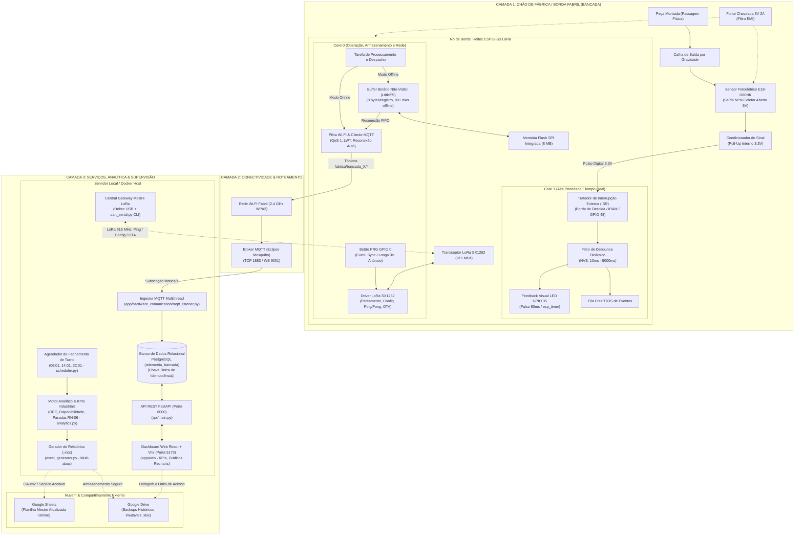
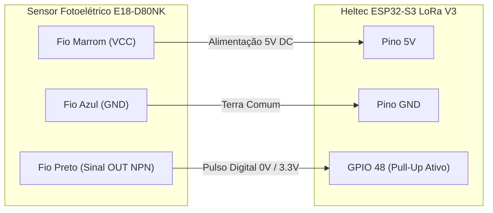

# EdgeBench: Sistema Embarcado IoT para Apontamento Automático de Produção

> **Solução Ciber-Física de Baixo Custo para Digitalização e Telemetria do Chão de Fábrica (Cenário 6)**  
> *Sensoriamento não-invasivo por barreira óptica, arquitetura de conectividade híbrida (Wi-Fi/MQTT + Rádio LoRa 915 MHz), bufferização offline de alta densidade, gateway mestre USB e integração analítica para PCP.*

---

## Identificação do Projeto

| Informação | Detalhes |
| :--- | :--- |
| **Título do Projeto** | **EdgeBench** — Sistema IoT Embarcado para Apontamento Automático de Produção em Postos de Trabalho Manuais |
| **Cenário de Referência** | Cenário 6 — Manufatura com bancadas de montagem manual e apontamento em pranchetas/planilhas no chão de fábrica |
| **Aplicação Principal** | Indústria 4.0, Sensoriamento Industrial Não Invasivo, Telemetria IoT e Automação de PCP (Planejamento e Controle da Produção) |
| **Equipe** | **Os Comédia** |
| **Integrantes** | • Amaro Junior Silva Luna<br>• Bruno da Silva Macedo<br>• Jonathas Levi Pascoal Palmeira<br>• Rodrigo Pinheiro Alcantara |

---

## Visão Geral do Projeto

Nas indústrias com linhas de montagem manuais, os operadores perdem frequentemente de **5% a 10% do seu tempo produtivo** registrando contagens de peças em pranchetas e formulários de papel. Esse processo tradicional gera três problemas críticos:
1. **Drenagem da capacidade produtiva** devido a constantes pausas operacionais;
2. **Erros humanos de contagem**, anotações retroativas e números imprecisos;
3. **Invisibilidade em tempo real** para o Planejamento e Controle da Produção (PCP), ocultando gargalos e paradas não programadas.

O **EdgeBench** resolve esse problema por meio de uma abordagem **100% passiva e não invasiva**: dispositivos de borda microcontrolados instalados nas calhas de escoamento das bancadas. Cada peça montada que desliza pela rampa de gravidade corta um feixe infravermelho modulado, sendo contabilizada instantaneamente por interrupção de hardware (*ISR*), com feedback visual imediato e transmissão por telemetria, sem demandar nenhuma intervenção do trabalhador.

---

## 1. Pré-requisitos

Esta seção lista **tudo** o que é necessário para reproduzir o projeto do zero.

### 1.1 Lista de Materiais

| Qtd. | Componente | Especificação | Função no Projeto |
| :---: | :--- | :--- | :--- |
| 1× | **Heltec WiFi LoRa 32 V3** | ESP32-S3FN8, SX1262, 8 MB Flash, USB-C | **Nó de Bancada** — sensoriamento e telemetria |
| 1× | **Heltec WiFi LoRa 32 V3** | ESP32-S3FN8, SX1262, 8 MB Flash, USB-C | **Central Gateway** — ponte USB ↔ LoRa |
| 1× | **Sensor Fotoelétrico E18-D80NK** | Barreira difusa, NPN coletor aberto, 5V, alcance 3–80 cm | Detecção de peças na calha de saída |
| 2× | **Cabo USB-C para USB-A/C** | Dados + alimentação, mínimo 1 m | Gravação de firmware e alimentação |
| 1× | **Fonte de alimentação 5V** | USB ou fonte externa 5V/1A | Alimentação da bancada em campo (quando sem USB do PC) |
| —  | **Jumpers / fios de conexão** | Macho-fêmea, 3 unidades (VCC, GND, SINAL) | Interligação do sensor ao ESP32 |

> **Nota:** Para cada bancada adicional no chão de fábrica, é necessário **1× Heltec WiFi LoRa 32 V3** e **1× Sensor E18-D80NK** adicionais. A Central Gateway é compartilhada por todas as bancadas via rádio LoRa.

### 1.2 Requisitos de Software

| Software | Versão Mínima | Finalidade | Link de Instalação |
| :--- | :---: | :--- | :--- |
| **ESP-IDF** | v5.5.x | Toolchain de compilação e gravação dos firmwares (bancada e central) | [docs.espressif.com/projects/esp-idf](https://docs.espressif.com/projects/esp-idf/en/v5.5.5/esp32s3/get-started/) |
| **Python** | 3.10+ | Painel Serial CLI (`uart_serial.py`) e Backend de dados | [python.org/downloads](https://www.python.org/downloads/) |
| **Git** | 2.30+ | Clonagem do repositório | [git-scm.com](https://git-scm.com/) |
| **Docker + Docker Compose** | 24.x / v2.x | Broker MQTT (Mosquitto), banco de dados (PostgreSQL) e backend em contêineres | [docs.docker.com/get-docker](https://docs.docker.com/get-docker/) |

> **Opcional:** Para integração com Google Sheets, é necessária uma conta Google Cloud com as APIs do Sheets e Drive habilitadas e um arquivo `google-credentials.json` de Service Account.

### 1.3 Requisitos de Infraestrutura de Rede

| Recurso | Detalhes |
| :--- | :--- |
| **Rede Wi-Fi 2.4 GHz** | As bancadas se conectam ao broker MQTT via Wi-Fi. A rede deve estar acessível no chão de fábrica. |
| **Computador com porta USB** | Para conexão da Central Gateway via cabo USB e execução do Painel Serial CLI / Docker. |

---

## 2. Arquitetura Integral do Sistema

A arquitetura do **EdgeBench** é estruturada em três camadas integradas, segregando claramente as responsabilidades de hardware, firmware de tempo real, comunicação por radiofrequência e serviços de dados na nuvem/servidor.

### 2.1 Diagrama Geral de Arquitetura Ponta a Ponta



### 2.2 Topologia de Mensagens MQTT e Modelo de Dados

#### Tópicos MQTT da Fábrica

| Tópico | Direção | QoS | Função e Conteúdo |
| :--- | :---: | :---: | :--- |
| `fabrica/bancada_<id>/producao` | Nó ➔ Broker | 1 | Eventos de contagem em tempo real e replay do buffer offline: `{"bancada_id": "BC-01", "contagem": 12, "delta_pecas": 1, "timestamp": 1726435200, "modo_offline": false}` |
| `fabrica/bancada_<id>/status` | Nó ➔ Broker | 1 | Heartbeat periódico e Last Will and Testament (LWT) configurado na inicialização: `{"bancada": 1, "status": "ONLINE"|"OFFLINE"|"PARADO", "timestamp": 1726435200}` |
| `fabrica/bancada_<id>/ota` | Server ➔ Nó | 1 | Gatilho de atualização OTA HTTP direcionado a uma bancada específica: `{"url": "http://192.168.1.50:8080/firmware.bin"}` |
| `fabrica/todas/ota` | Server ➔ Broadcast | 1 | Gatilho de atualização OTA HTTP em broadcast para todo o chão de fábrica. |

#### Modelo de Dados e Garantia de Idempotência (PostgreSQL)

Para garantir que retransmissões MQTT (QoS 1) ou o descarregamento em lote de buffers offline (*FIFO replay*) nunca gerem contagens duplicadas no banco central, a tabela `telemetria_bancada` implementa uma chave de idempotência estrita:

```sql
CREATE TABLE telemetria_bancada (
    id SERIAL PRIMARY KEY,
    bancada_id VARCHAR(20) NOT NULL,
    contagem_total INTEGER NOT NULL,
    delta_pecas INTEGER NOT NULL DEFAULT 0,
    timestamp_esp TIMESTAMP WITHOUT TIME ZONE NOT NULL,
    timestamp_servidor TIMESTAMP WITH TIME ZONE DEFAULT NOW(),
    status_bancada VARCHAR(30) NOT NULL DEFAULT 'DESCONHECIDO',
    idempotency_key VARCHAR(120) NOT NULL UNIQUE
);

CREATE INDEX ix_telemetria_bancada_timestamp ON telemetria_bancada(bancada_id, timestamp_esp);
```

* **Fórmula da Chave de Idempotência:** `idempotency_key = "{bancada_id}_{timestamp_esp}_{contagem_total}"`.  
  Qualquer registro repetido é automaticamente descartado pelo banco via cláusula `IntegrityError` no ingestor sem causar falha no processamento.

---

## 3. Componentes de Hardware e Pinagem

O projeto adota o kit **Heltec WiFi LoRa 32 V3**, integrando microcontrolador dual-core, conectividade Wi-Fi, rádio LoRa de longo alcance e suporte a periféricos industriais.

### 3.1 Mapeamento de Pinos da Bancada (Nó de Borda)

| Periférico / Função | Pino no ESP32-S3 | Modo / Nível Lógico | Descrição Técnica |
| :--- | :---: | :--- | :--- |
| **Sensor E18-D80NK (Sinal OUT)** | **GPIO 48** | Entrada com Pull-up interno | Saída NPN coletor aberto (0V na detecção da peça, 3.3V em repouso). |
| **LED Indicador Onboard** | **GPIO 35** | Saída Digital (Ativo Alto) | Feedback visual imediato de passagem de peça (pulso 80ms) e Ping Broadcast (150ms). |
| **Botão Físico PRG Onboard** | **GPIO 0** | Entrada com Pull-up interno | Toque curto (<1.5s): sync de hora/config; Toque médio (>3s): anúncio de pareamento; Toque longo (10s): Factory reset. 
| **Alimentação do Sensor (VCC)** | **5V / VBUS** | 5V DC | Alimentação positiva do sensor fotoelétrico. |
| **Referência de Terra (GND)** | **GND** | 0V | Terra comum entre fonte, sensor e microcontrolador. |
| **LoRa SX1262 NSS** | **GPIO 8** | Saída SPI (Chip Select) | Seleção do chip LoRa via barramento SPI dedicado. |
| **LoRa SX1262 SCK** | **GPIO 9** | Saída SPI (Clock) | Sinal de clock do barramento SPI (até 10 MHz). |
| **LoRa SX1262 MOSI** | **GPIO 10** | Saída SPI (Master Out) | Linha de dados do mestre para o transceptor. |
| **LoRa SX1262 MISO** | **GPIO 11** | Entrada SPI (Master In) | Linha de dados do transceptor para o mestre. |
| **LoRa SX1262 RST** | **GPIO 12** | Saída Digital | Reset de hardware do SX1262. |
| **LoRa SX1262 BUSY** | **GPIO 13** | Entrada Digital | Sinal de ocupado do rádio (indica prontidão para comandos SPI). |
| **LoRa SX1262 DIO1** | **GPIO 14** | Entrada com Interrupção | Interrupção externa disparada ao concluir recepção/transmissão RF. |
| **LoRa VEXT Control** | **GPIO 36** | Saída Digital (Ativo Baixo) | Chaveamento de alimentação dos periféricos onboard da Heltec. |

### 3.2 Instruções de Montagem Elétrica — Sensor E18-D80NK

O sensor fotoelétrico E18-D80NK possui **3 fios** que devem ser conectados ao ESP32 da bancada conforme o diagrama abaixo:



**Passo a passo da conexão:**

1. **Fio Marrom (VCC)** → conectar ao pino **5V** (VBUS) da Heltec.
2. **Fio Azul (GND)** → conectar ao pino **GND** da Heltec.
3. **Fio Preto (Sinal OUT)** → conectar ao pino **GPIO 48** da Heltec.

> **Nota de Proteção Elétrica:** O sensor E18-D80NK possui saída NPN em coletor aberto. O pull-up interno do ESP32 (`GPIO_PULLUP_ENABLE`) mantém a linha em **3.3V** em repouso. Ao detectar a peça, o transistor interno do sensor conecta o pino ao terra (**0V**), gerando borda de descida perfeitamente segura e imune a sobretensão.

> **Importante:** A Central Gateway **não requer conexão de sensor**. Ela é conectada apenas via cabo USB ao computador e funciona como ponte LoRa ↔ Serial.

---

## 4. Protocolo de Comunicação LoRa (EdgeBench RF)

Nas fábricas, quedas de Wi-Fi e panes elétricas podem ocorrer simultaneamente. O **EdgeBench** implementa um protocolo ponto-multiponto determinístico sobre rádio LoRa (915 MHz, SF7, BW 125 kHz, CR 4/5) para diagnóstico, sincronização, reconfiguração remota e telemetria de fallback.

### 4.1 Formato Geral do Pacote

Todos os pacotes LoRa possuem o byte identificador do projeto `0xEB` no cabeçalho:

| Byte 0 | Byte 1 | Bytes 2..N |
| :---: | :---: | :--- |
| `0xEB` *(Identificador)* | `Msg Type` *(Opcode)* | *Payload específico do comando/resposta* |

### 4.2 Tabela de Opcodes e Estrutura dos Pacotes

| Opcode | Mnemônico | Direção | Descrição / Payload |
| :---: | :--- | :---: | :--- |
| `0x10` | `LORA_MSG_REQ_TIME` | Nó ➔ Central | Solicita sincronização temporal: `[0xEB, 0x10, MAC(6B), BENCH_ID(2B)]` |
| `0x11` | `LORA_MSG_RESP_TIME` | Central ➔ Nó | Resposta/Beacon de horário: `[0xEB, 0x11, TARGET_MAC(6B), EPOCH(8B)]` |
| `0x20` | `LORA_MSG_REQ_CONFIG` | Nó ➔ Central | Solicita credenciais: `[0xEB, 0x20, MAC(6B), BENCH_ID(2B)]` |
| `0x21` | `LORA_MSG_RESP_CONFIG` | Central ➔ Nó | Envia SSID, senha e broker: `[0xEB, 0x21, MAC(6B), TOKEN(4B), SSID_LEN, SSID, PASS_LEN, PASS, BROKER_LEN, BROKER]` |
| `0x30` | `LORA_MSG_CMD_SET_BENCH` | Central ➔ Nó | Configura ID da bancada: `[0xEB, 0x30, TARGET_MAC(6B), TARGET_ID(2B), TOKEN(4B), NEW_ID(2B)]` |
| `0x31` | `LORA_MSG_REQ_BENCH_INFO`| Central ➔ Nó | Consulta endereço MAC de uma bancada: `[0xEB, 0x31, TARGET_ID(2B)]` |
| `0x32` | `LORA_MSG_RESP_BENCH_INFO`| Nó ➔ Central | Responde identificação: `[0xEB, 0x32, MAC(6B), BENCH_ID(2B)]` |
| `0x33` | `LORA_MSG_ANNOUNCE_PAIRING`| Nó ➔ Central | Anúncio de pareamento físico pelo botão: `[0xEB, 0x33, MAC(6B), BENCH_ID(2B)]` |
| `0x40` | `LORA_MSG_CMD_OTA` | Central ➔ Nó | Comanda início de OTA: `[0xEB, 0x40, TARGET_ID(2B), TOKEN(4B), URL_LEN, URL]` |
| `0x50` | `LORA_MSG_TELEMETRY` | Nó ➔ Central | Telemetria de fallback offline: `[0xEB, 0x50, MAC(6B), BENCH_ID(2B), COUNT(4B), TIMESTAMP(8B)]` |
| `0x60` | `LORA_MSG_CMD_SET_DEBOUNCE`| Central ➔ Nó | Configura debounce em ms: `[0xEB, 0x60, TARGET_MAC(6B), TARGET_ID(2B), TOKEN(4B), DEBOUNCE_MS(4B)]` |
| `0x70` | `LORA_MSG_CMD_PING` | Central ➔ Broadcast | Disparo de Ping para descobrir bancadas online: `[0xEB, 0x70, TOKEN(4B)]` |
| `0x71` | `LORA_MSG_RESP_PONG` | Nó ➔ Central | Resposta individual de presença: `[0xEB, 0x71, MAC(6B), BENCH_ID(2B)]` |

* **Token de Segurança:** Comandos críticos exigem o token `0xABCD1234` para rejeitar pacotes espúrios ou ruídos de RF.

### 4.3 Regras de Endereçamento e Prevenção de Colisão

1. **Broadcast (`FF:FF:FF:FF:FF:FF`):** Utilizado para sincronização de horário (`RESP_TIME`), credenciais Wi-Fi globais (`RESP_CONFIG`) e descoberta (`CMD_PING`).
2. **Proteção Rigorosa de Setup (`ID == 0`):** Uma bancada recém-gravada inicia com ID `0` (*Não Configurada*). Para evitar que duas placas novas recebam o mesmo ID acidentalmente por broadcast, **uma bancada com ID 0 rejeita expressamente broadcasts de configuração** (`CMD_SET_BENCH`). Ela exige que o comando contenha seu endereço MAC individual específico.
3. **Anti-Collision Jitter no Ping Broadcast:** Ao receber `CMD_PING` (0x70), para impedir que múltiplos nós transmitam ao mesmo tempo destruindo pacotes no ar (colisão ALOHA), cada bancada calcula um atraso pseudo-aleatório (`50ms a 1200ms` via `esp_random()`) antes de responder com `RESP_PONG`, garantindo que todas as bancadas sejam ouvidas pela Central.

---

## 5. Recursos de Firmware e Usabilidade em Campo

### 5.1 Botão Físico Multifunção (PRG - GPIO 0)
Permite comissionar e configurar bancadas no chão de fábrica sem computador ou cabo USB:
* **Toque Curto (< 1.5s):** A bancada transmite `REQ_TIME` e `REQ_CONFIG` via LoRa, solicitando imediatamente horário e credenciais da rede para a Central.
* **Toque Longo (> 3s):** A bancada entra em modo de pareamento e emite `ANNOUNCE_PAIRING` (0x33). O operador na estação central vê o MAC e o ID no menu interativo do CLI e define o novo ID numerico da bancada na hora.

### 5.2 Feedback Visual Não-Bloqueante (LED - GPIO 35)
* **Passagem de Peça:** Dispara um pulso luminoso de **80 ms** acionado via `esp_timer` no Core 1.
* **Ping Broadcast:** Pisca por **150 ms** indicando que a placa recebeu a sondagem de rádio da Central.

### 5.3 Debounce Dinâmico em Memória Não-Volátil (NVS)
O tempo de debounce do sensor óptico pode ser ajustado de **10 ms a 5000 ms** remotamente via LoRa (`CMD_SET_DEBOUNCE`), sem necessidade de recompilar ou reiniciar o firmware. O novo valor é aplicado dinamicamente na ISR e gravado na NVS.

### 5.4 Atualização Remota de Firmware (OTA)
O particionamento da Flash conta com duas áreas de aplicação (`ota_0` e `ota_1`) de 1.5 MB cada e controle de rollback automático. O processo pode ser disparado tanto por comando LoRa (`CMD_OTA`) quanto pelo tópico MQTT `fabrica/bancada_<id>/ota`, realizando o download HTTP com validação SHA-256 e confirmação de inicialização bem-sucedida.

---

## 6. Estrutura e Organização do Repositório

```
EdgeBench/
├── README.md                                  # Guia mestre de arquitetura, protocolo e instruções (este documento)
├── LICENSE                                    # Licença MIT
├── firmware_bancada/                          # Firmware do Nó de Borda Fabril (ESP32-S3 de Bancada)
│   ├── CMakeLists.txt                         # Script de compilação do projeto da bancada
│   ├── partitions.csv                         # Particionamento: nvs, otadata, ota_0, ota_1, storage (LittleFS)
│   ├── sdkconfig.defaults                     # Configurações do SDK (FreeRTOS dual-core, clock 240MHz)
│   └── main/
│       ├── app_main.c                         # Ponto de entrada, orquestração e inicialização dos subsistemas
│       ├── sensor_manager.c/.h                # ISR no Core 1, debounce dinâmico e feedback no LED GPIO 35
│       ├── storage_manager.c/.h               # Buffer binário não-volátil (LittleFS, 8 bytes por registro)
│       ├── nvs_manager.c/.h                   # Gerenciamento NVS (Wi-Fi, Broker, Bench ID, Debounce)
│       ├── wifi_manager.c/.h                  # Pilha Wi-Fi com reconexão automática e reconfiguração dinâmica
│       ├── mqtt_manager.c/.h                  # Cliente MQTT QoS 1, tópicos dinâmicos e dreno FIFO pós-queda
│       ├── lora_receiver.c/.h                 # Transceptor SX1262 SPI, parser de pacotes, Ping/Pong, Beacon e OTA
│       ├── button_manager.c/.h                # Tratamento do botão PRG (toque curto e anúncio de pareamento 3s)
│       ├── ota_manager.c/.h                   # Motor de download OTA HTTP com rollback de segurança
│       └── Kconfig.projbuild                  # Configurações padrão via menuconfig
├── firmware_central/                          # Firmware do Gateway Central Mestre USB (ESP32-S3)
│   ├── CMakeLists.txt                         # Script de compilação do Gateway Central
│   ├── sdkconfig.defaults                     # Configurações mínimas do SDK da Central
│   └── main/
│       ├── main.c                             # Ponto de entrada da Central
│       ├── lora_transmitter.c/.h              # Transmissor e receptor contínuo LoRa SX1262
│       ├── serial_bridge.c/.h                 # Ponte serial UART bidirecional (Parser JSON <-> Comandos LoRa)
│       └── nvs_config.c/.h                    # Persistência de credenciais mestres de Wi-Fi e Broker
├── app/                                       # Backend de Ingestão, Painel Serial e Analítica (Python)
│   ├── main.py                                # Ponto de entrada consolidado dos serviços Python
│   ├── requirements.txt                       # Dependências Python do projeto
│   ├── .env.example                           # Modelo de variáveis de ambiente (copiar para .env)
│   ├── docker-compose.yml                     # Orquestração: Mosquitto + PostgreSQL + Backend + API + Web
│   ├── Dockerfile                             # Contêiner multi-stage do backend de dados e API
│   ├── api/                                   # Camada de Apresentação e Integração REST
│   │   └── main.py                            # API FastAPI (status em tempo real, OEE, listagem/download de relatórios)
│   ├── web/                                   # Frontend Web Dashboard Industrial (React 19 + Vite + TypeScript)
│   │   ├── package.json                       # Scripts e dependências do frontend (Recharts, Lucide)
│   │   ├── vite.config.ts                     # Configuração do Vite dev server
│   │   └── src/                               # Componentes, gráficos e dashboard interativo (App.tsx)
│   ├── settings/                              # Configurações Globais e Banco de Dados
│   │   ├── config.py                          # Configurações via variáveis de ambiente (.env)
│   │   ├── database.py                        # Conexão com banco de dados (PostgreSQL/SQLite)
│   │   └── models.py                          # Modelos relacionais (SQLAlchemy) e chaves de idempotência
│   ├── hardware_comunication/                 # Comunicação com hardware (LoRa, MQTT, UART)
│   │   ├── mqtt_listener.py                   # Ingestor MQTT multithread com deduplicação
│   │   └── uart_serial.py                     # Painel interativo CLI para controle do Gateway LoRa
│   ├── external_integrations/                 # Integrações externas em nuvem (Google Drive, Sheets)
│   │   ├── auth_google.py                     # Gerenciamento de credenciais e fluxo OAuth2 do Google
│   │   └── google_sheets_sync.py              # Sincronização automatizada para Google Drive e Google Sheets
│   ├── services/                              # Serviços de processamento de dados e rotinas
│   │   ├── analytics.py                       # Indicadores industriais, OEE, paradas RN-06 e turnos T1/T2/T3
│   │   ├── excel_generator.py                 # Geração de planilhas industriais multi-abas com OpenPyXL
│   │   └── scheduler.py                       # Agendador de tarefas em segundo plano (fechamento de turnos)
│   └── mosquitto/
│       └── mosquitto.conf                     # Configuração do broker Mosquitto (listeners, persistência)
└── requisitos/
    └── especificacao_tecnica.md               # Especificação aprofundada: RFs, RNFs, análise mecânica e cinemática
```

### Rastreabilidade de Módulos e Funcionalidades

| Módulo da Arquitetura | Arquivo Principal | Função Central |
| :--- | :--- | :--- |
| **Sensoriamento & Debounce** | [`firmware_bancada/main/sensor_manager.c`](firmware_bancada/main/sensor_manager.c) | Contagem atômica na ISR, debounce dinâmico, pulso do LED GPIO 35. |
| **Armazenamento Offline** | [`firmware_bancada/main/storage_manager.c`](firmware_bancada/main/storage_manager.c) | Buffer binário de 8 bytes na partição LittleFS (90+ dias de autonomia). |
| **Protocolo LoRa das Bancadas** | [`firmware_bancada/main/lora_receiver.c`](firmware_bancada/main/lora_receiver.c) | Recepção de Beacons, pareamento, Ping/Pong e atualização OTA. |
| **Botão de Setup Rápido** | [`firmware_bancada/main/button_manager.c`](firmware_bancada/main/button_manager.c) | Toque curto (<1.5s) e toque longo (>3s) para anúncio de pareamento. |
| **Gateway Mestre LoRa** | [`firmware_central/main/lora_transmitter.c`](firmware_central/main/lora_transmitter.c) | Transmissão de comandos de rádio e escuta RX contínua na Central. |
| **Ponte Serial UART** | [`firmware_central/main/serial_bridge.c`](firmware_central/main/serial_bridge.c) | Tradução bidirecional entre comandos JSON serial e pacotes RF. |
| **Painel Serial & Driver** | [`app/hardware_comunication/uart_serial.py`](app/hardware_comunication/uart_serial.py) | Menu com 11 funções (Ping Broadcast, Pareamento, Servidor HTTP OTA). |
| **Ingestor de Telemetria** | [`app/hardware_comunication/mqtt_listener.py`](app/hardware_comunication/mqtt_listener.py) | Ingestão MQTT com chave única `(bench_id, timestamp)` para idempotência. |
| **Configuração Centralizada** | [`app/settings/config.py`](app/settings/config.py) | Leitura de variáveis de ambiente (`.env`) com defaults seguros. |
| **Banco de Dados & ORM** | [`app/settings/models.py`](app/settings/models.py) | Schema relacional `telemetria_bancada` com índice composto e idempotência. |
| **Motor Analítico & OEE** | [`app/services/analytics.py`](app/services/analytics.py) | Agregações de produção por turno (T1, T2, T3), taxas e paradas ociosas (RN-06). |
| **Geração de Relatórios Excel** | [`app/services/excel_generator.py`](app/services/excel_generator.py) | Planilhas `.xlsx` formatadas para auditoria do PCP com gráficos e métricas. |
| **Agendador de Fechamentos** | [`app/services/scheduler.py`](app/services/scheduler.py) | Disparo automático no fim de cada turno (06:01, 14:01, 22:01) e backup. |
| **API REST FastAPI** | [`app/api/main.py`](app/api/main.py) | Endpoints REST (`/api/status`, `/api/reports`) para integração e dashboard. |
| **Dashboard Web Industrial** | [`app/web/src/App.tsx`](app/web/src/App.tsx) | Interface React moderna com gráficos Recharts e monitoramento em tempo real. |
| **Nuvem Google Sheets/Drive**| [`app/external_integrations/google_sheets_sync.py`](app/external_integrations/google_sheets_sync.py) | Sincronização da planilha mestre online e arquivo histórico no Drive. |

---

## 7. Guia Completo de Instalação, Configuração e Execução

Esta seção detalha **todos os passos necessários** para replicar o ambiente e executar o projeto, partindo de uma máquina limpa.

### 7.1 Clonar o Repositório

```bash
git clone https://github.com/rodrigop07/EdgeBench.git EdgeBench
cd EdgeBench
```

### 7.2 Instalar o ESP-IDF (Toolchain de Firmware)

O ESP-IDF é necessário para compilar e gravar os firmwares da bancada e da central.

**Linux / macOS:**
```bash
mkdir -p ~/esp
cd ~/esp
git clone -b v5.5.5 --recursive https://github.com/espressif/esp-idf.git
cd esp-idf
./install.sh esp32s3
source export.sh
```

**Windows (PowerShell):**

Baixe e execute o [instalador ESP-IDF](https://dl.espressif.com/dl/esp-idf/) ou use o terminal do ESP-IDF Tools Installer:
```powershell
# Após a instalação, abra o "ESP-IDF PowerShell" do menu Iniciar
# ou carregue manualmente o profile:
& "C:\Espressif\tools\Microsoft.v5.5.5.PowerShell_profile.ps1"
```

> **Verificação:** Execute `idf.py --version` e confirme que a versão exibida é `v5.5.x`.

### 7.3 Compilar e Gravar o Firmware da Bancada (`firmware_bancada/`)

1. Conecte a placa Heltec da **bancada** ao computador via cabo USB-C.
2. Identifique a porta serial: `COM3` (Windows), `/dev/ttyUSB0` ou `/dev/ttyACM0` (Linux/macOS).

```bash
cd firmware_bancada
idf.py set-target esp32s3
idf.py build
idf.py -p <PORTA_SERIAL> flash monitor
```

> Substitua `<PORTA_SERIAL>` pela porta identificada (ex: `COM3`, `/dev/ttyACM0`).

**Saída esperada no monitor serial (boot bem-sucedido):**
```
I (xxx) APP_MAIN: [APP] Startup..
I (xxx) APP_MAIN: [APP] Memoria livre: 2XXXXX bytes
I (xxx) APP_MAIN: [APP] IDF Versao: v5.5.5
I (xxx) APP_MAIN: Boot count atual: 1
W (xxx) APP_MAIN: ATENCAO: ID da Bancada NAO CONFIGURADO, aguardando pareamento ou configuracao via LoRa.
I (xxx) LORA_RCV: Rádio LoRa SX1262 inicializado com sucesso em 915 MHz
I (xxx) APP_MAIN: SNTP inicializado em background (servidor: a.st1.ntp.br, fuso: UTC-3)
```

> **Nota:** Na primeira gravação, a bancada inicia com ID `0` (não configurada) e sem credenciais Wi-Fi. Isso é normal — a configuração será feita via LoRa no passo 7.7.

### 7.4 Compilar e Gravar o Firmware da Central Gateway (`firmware_central/`)

1. **Desconecte** a bancada e conecte a placa Heltec da **Central Gateway** via USB-C.

```bash
cd firmware_central
idf.py set-target esp32s3
idf.py build
idf.py -p <PORTA_SERIAL> flash monitor
```

**Saída esperada no monitor serial (boot bem-sucedido):**
```
I (xxx) GATEWAY_CENTRAL: =================================================
I (xxx) GATEWAY_CENTRAL:    EdgeBench - ESP32S3 LoRa USB Central
I (xxx) GATEWAY_CENTRAL: =================================================
I (xxx) GATEWAY_CENTRAL: Gateway Central pronto em modo servidor sob demanda (RX padrao, TX em respostas)
```

> Após gravar, **mantenha a Central conectada via USB** ao computador. Ela será controlada pelo Painel Serial CLI.

### 7.5 Configurar e Iniciar os Serviços de Backend (Docker Compose)

O ecossistema de software central (Broker MQTT, Banco de Dados, Ingestor/Scheduler, API REST e Dashboard Web) roda orquestrado via Docker Compose em 5 contêineres integrados:

**1. Crie o arquivo de variáveis de ambiente:**
```bash
cd app
cp .env.example .env
```

**2. (Opcional) Edite o `.env` conforme seu ambiente:**
```dotenv
# Banco de Dados
POSTGRES_HOST=localhost
POSTGRES_PORT=5432
POSTGRES_DB=edgebench
POSTGRES_USER=edgebench_user
POSTGRES_PASSWORD=edgebench_pass

# Broker MQTT
MQTT_HOST=localhost
MQTT_PORT=1883
MQTT_TOPIC_FILTER=fabrica/+/#

# Integração Google Drive / Sheets (Opcional)
GOOGLE_APPLICATION_CREDENTIALS=google-credentials.json
GOOGLE_DRIVE_FOLDER_ID=
```

**3. Inicie todos os serviços:**
```bash
docker-compose up -d --build
```

**4. Verifique que os cinco contêineres estão operacionais:**
```bash
docker-compose ps
```

**Saída esperada:**
```
NAME                  IMAGE                      STATUS
edgebench_mosquitto   eclipse-mosquitto:2.0      Up (healthy)
edgebench_postgres    postgres:15-alpine         Up (healthy)
edgebench_backend     edgebench_backend:latest   Up
edgebench_api         edgebench_backend:latest   Up
edgebench_web         node:20-alpine             Up
```

#### Portas e Endpoints do Sistema

| Serviço | Contêiner | Porta Exposta | Descrição / URL de Acesso |
| :--- | :--- | :---: | :--- |
| **Dashboard Web (Frontend)** | `edgebench_web` | **5173** | [`http://localhost:5173`](http://localhost:5173) — Painel industrial React para operadores e PCP |
| **API REST (FastAPI)** | `edgebench_api` | **8000** | [`http://localhost:8000/docs`](http://localhost:8000/docs) — Documentação Swagger interativa da API |
| **Broker MQTT (Mosquitto)** | `edgebench_mosquitto`| **1883** / **9001** | `1883` (TCP para ESP32 e Ingestor) e `9001` (WebSockets) |
| **Banco de Dados (PostgreSQL)**| `edgebench_postgres`| **5433** | Host `localhost:5433` (redirecionado internamente para `5432`) |
| **Ingestor & Scheduler** | `edgebench_backend` | — | Processa filas MQTT, executa cálculos OEE e dispara backups |

> **Nota para as Bancadas:** As placas Heltec de bancada devem ser configuradas para apontar o broker MQTT para o IP local do seu computador na rede Wi-Fi (ex: `mqtt://192.168.1.100:1883`), e não `localhost`.

> **Desenvolvimento Local do Frontend (Opcional sem Docker):**  
> Para rodar a interface Web diretamente no Node.js local:
> ```bash
> cd app/web
> npm install
> npm run dev
> ```

### 7.6 Iniciar o Painel Serial CLI (`app/hardware_comunication/uart_serial.py`)

O Painel Serial é a ferramenta de linha de comando que controla a Central Gateway para configuração das bancadas.

**1. Crie e ative um ambiente virtual Python:**

*Linux/macOS:*
```bash
cd app
python3 -m venv venv
source venv/bin/activate
pip install -r requirements.txt
```

*Windows (PowerShell):*
```powershell
cd app
python -m venv venv
.\venv\Scripts\Activate.ps1
pip install -r requirements.txt
```

**2. Execute o painel (com a Central Gateway conectada via USB):**
```bash
python hardware_comunication/uart_serial.py
```

**Saída esperada (menu interativo):**
```
============================================================
    EdgeBench - Painel Serial Central
============================================================

Selecione uma operacao:
  [1] Testar conexao com Gateway (Ping local)
  [2] Ping Broadcast LoRa (Descobrir todas as bancadas online: MAC e ID)
  [3] Sincronizar Horario do PC (Emitir Beacon de Horario)
  [4] Reconfigurar Wi-Fi das bancadas via LoRa
  [5] Reconfigurar Broker MQTT das bancadas via LoRa
  [6] Reconfigurar ID de Bancada via LoRa (identificando pelo ID atual)
  [7] Consultar MAC de uma Bancada via LoRa
  [8] Monitorar logs contínuos da Serial
  [9] Modo de Pareamento Rápido (Aguardando botão físico da bancada...)
  [10] Gerenciar Atualização OTA de Firmware (Servidor Local / LoRa / MQTT)
  [11] Reconfigurar Tempo de Debounce do Sensor via LoRa
  [0] Sair
```

### 7.7 Fluxo Completo: Da Primeira Gravação ao Primeiro Registro

Após gravar ambos os firmwares e iniciar os serviços, siga este roteiro para comissionar a primeira bancada:

```mermaid
flowchart LR
    A["1. Energizar\nbancada"] --> B["2. Ping Broadcast\n(Opção 2 do CLI)"]
    B --> C["3. Bancada responde\ncom MAC e ID=0"]
    C --> D["4. Pareamento\n(Opção 9 do CLI +\nbotão 3s na bancada)"]
    D --> E["5. Definir ID\n(ex: ID=1)"]
    E --> F["6. Enviar Wi-Fi\n(Opção 4 do CLI)"]
    F --> G["7. Enviar Broker\n(Opção 5 do CLI)"]
    G --> H["8. Sync Horário\n(Opção 3 do CLI)"]
    H --> I["9. Bancada conecta\nao Wi-Fi e MQTT"]
    I --> J["10. Peça na calha\n→ LED pisca\n→ Registro publicado"]
```



**Passo a passo detalhado:**

| Passo | Ação | Comando/Procedimento |
| :---: | :--- | :--- |
| 1 | Energizar a bancada | Conecte via USB ou fonte 5V. O LED piscará 1× no boot. |
| 2 | Verificar que a bancada está no ar | No CLI, selecione **[2] Ping Broadcast**. Todas as bancadas ao alcance respondem. |
| 3 | Identificar a bancada nova | A bancada aparecerá com **ID = 0** (não configurada) e seu MAC. |
| 4 | Parear a bancada | No CLI, selecione **[9] Modo de Pareamento**. Na bancada, **segure o botão PRG por 3 segundos**. O CLI detecta o anúncio. |
| 5 | Atribuir um ID numérico | O CLI solicita o novo ID. Digite um número único (ex: `1`). |
| 6 | Enviar credenciais Wi-Fi | Selecione **[4]** e informe o SSID e a senha da rede Wi-Fi da fábrica. |
| 7 | Enviar URL do Broker MQTT | Selecione **[5]** e informe o endereço do broker (ex: `mqtt://192.168.1.100:1883`). |
| 8 | Sincronizar horário | Selecione **[3]** para emitir um beacon de horário via LoRa. |
| 9 | Aguardar conexão | A bancada se conecta automaticamente ao Wi-Fi e ao broker MQTT. |
| 10 | Testar detecção | Passe um objeto pela frente do sensor. O LED pisca e o registro é publicado no tópico `fabrica/bancada_1/producao`. |

---

## 8. Verificação da Execução — Resultados Esperados

Esta seção documenta as **saídas que confirmam o funcionamento correto** de cada componente do sistema.

### 8.1 Monitor Serial da Bancada (Detecção de Peça)

Ao passar uma peça pela frente do sensor após o comissionamento completo:

```
[ISR] Interrupcao detectada no GPIO 48 (Sensor E18-D80NK)!
I (xxxxx) SENSOR_MGR: Detecção no Core 1 - Total acumulado: 1 peças
I (xxxxx) MQTT_MGR: Mensagem publicada em 'fabrica/bancada_1/producao' (QoS 1, id: xxxxx, offline: false)
I (xxxxx) MQTT_MGR: MQTT_EVENT_PUBLISHED (PUBACK recebido), msg_id=xxxxx
```

### 8.2 Monitor Serial da Central (Recepção LoRa)

Ao receber um pacote de telemetria LoRa de uma bancada offline:

```
I (xxxxx) LORA_TX: [RX] Pacote recebido (22 bytes, RSSI: -xx dBm)
I (xxxxx) LORA_TX: [TELEMETRIA] Bancada 1 | Contagem: 5 | Timestamp: 1726435200
```

### 8.3 Teste MQTT via Linha de Comando

Para verificar que o broker está recebendo publicações das bancadas:

```bash
# Em um terminal separado, inscreva-se em todos os tópicos das bancadas:
mosquitto_sub -h localhost -p 1883 -t "fabrica/bancada_+/producao" -v
```

**Saída esperada ao detectar uma peça:**
```
fabrica/bancada_1/producao {"bench_id":1,"count":1,"timestamp":1726435200,"source":"wifi"}
```

### 8.4 Logs do Backend Python (Docker)

Para verificar que o ingestor MQTT está recebendo e persistindo registros:

```bash
docker-compose logs -f backend
```

**Saída esperada:**
```
2026-09-16T08:00:00 [INFO    ] edgebench.mqtt — Conectado ao broker mosquitto:1883
2026-09-16T08:00:00 [INFO    ] edgebench.mqtt — Inscrito em 'fabrica/bancada_+/producao' (QoS 1)
2026-09-16T08:01:23 [INFO    ] edgebench.mqtt — Registro persistido: bench_id=1, count=1, ts=2026-09-16T08:01:23
```

### 8.5 Geração de Relatório Excel (Sob Demanda)

```bash
docker-compose run --rm backend python main.py --export --bancada 1
```

**Saída esperada:**
```
2026-09-16T08:05:00 [INFO    ] edgebench.excel — Relatório gerado: reports/bancada_1_2026-09-16.xlsx
```

O arquivo `.xlsx` estará disponível na pasta `app/reports/`.

### 8.6 Acesso e Verificação do Dashboard Web e API REST

**1. Testar resposta da API REST via cURL:**
```bash
curl http://localhost:8000/api/status
```

**Saída esperada (JSON com KPIs globais e por bancada):**
```json
{
  "success": true,
  "data": {
    "global_kpis": {
      "total_pecas": 128,
      "bancadas_ativas": 2,
      "taxa_pecas_hora": 42.6,
      "total_paradas": 0
    },
    "kpis_bancadas": [
      {
        "bancada": "BC-01",
        "total_pecas": 65,
        "disponibilidade": 98.4,
        "paradas": 0,
        "tempo_parado": 0.0,
        "taxa_pecas_hora": 21.6
      }
    ]
  }
}
```

**2. Acessar o Dashboard Web no Navegador:**
* Abra [`http://localhost:5173`](http://localhost:5173) no seu navegador.
* **Recursos visuais disponíveis:**
  * Cartões de métricas consolidadas (Total de Peças, Bancadas Ativas, Taxa Horária e Paradas de Linha).
  * Gráfico interativo de produção por hora (Recharts) global e segmentado por bancada.
  * Monitor individual de cada posto com porcentagem de disponibilidade e tempo ocioso.
  * Aba de **Relatórios Cloud** com listagem direta dos arquivos sincronizados no Google Drive e links de download local `.xlsx`.

### 8.7 Fechamento Automático de Turno e Sincronização em Nuvem (Google Sheets/Drive)

O serviço de agendamento em segundo plano (`app/services/scheduler.py`) executa rotinas automáticas de fechamento nos horários pré-definidos dos três turnos da fábrica:
* **06:01** — Fechamento do **Turno 3 (T3: 22h às 06h)**.
* **14:01** — Fechamento do **Turno 1 (T1: 06h às 14h)**.
* **22:01** — Fechamento do **Turno 2 (T2: 14h às 22h)**.

A cada fechamento operacional, o sistema executa automaticamente:
1. Agrupamento e processamento de todas as leituras e deltas de peças do turno.
2. Geração da planilha Excel com abas de Resumo e Detalhamento em `app/reports/backups/EdgeBench_Fechamento_<timestamp>.xlsx`.
3. Atualização online da planilha mestra **`EdgeBench_Painel_Producao`** no Google Sheets.
4. Gravação de backup imutável do fechamento na pasta do Google Drive configurada.

> **Exportação Manual com Envio Imediato para a Nuvem:**
> ```bash
> docker-compose run --rm backend python main.py --export --bancada BC-01 --upload-drive
> ```

---

## 9. Principais Diferenciais de Engenharia

1. **Salvamento Local:** Em caso de falha de infraestrutura de rede, o nó armazena os registros em memória Flash não volátil com particionamento LittleFS e proteção contra desligamentos abruptos de energia.
2. **Buffer Binário de Alta Densidade (8 Bytes):** Cada registro de produção consome apenas 8 bytes (`count` + `timestamp`), comportando mais de **131.000 eventos** em apenas 1 MB de Flash (mais de **90 dias de autonomia** contínua sem Wi-Fi).
3. **Pilha Dual-Core Segregada:**
   * **Core 1:** Exclusivo para tempo real crítico (ISR do sensor óptico, debounce temporal e pulso do LED).
   * **Core 0:** Gerenciamento das pilhas de rede Wi-Fi, cliente MQTT, rádio LoRa e operações de Flash.
4. **Resiliência Máxima por LoRa 915 MHz:** Recuperação de horário absoluto, reconfiguração remota e telemetria de emergência mesmo durante apagões simultâneos de rede na fábrica.
5. **Comissionamento Zero-Config:** Identificação inicial por anúncio físico de botão (3 segundos) e descoberta por Ping Broadcast com anti-colisão no ar.

---

## 10. Documentação Complementar

Para consultar os requisitos detalhados de engenharia, especificações funcionais e não-funcionais (RFs/RNFs), análise cinemática da rampa de peças e comparativo técnico entre IoT e Visão Computacional, consulte:

📄 **[especificacao_tecnica.md](requisitos/especificacao_tecnica.md)**

---

## Licença

Este projeto é licenciado sob a **Licença MIT** — consulte o arquivo [`LICENSE`](LICENSE) para mais detalhes.
