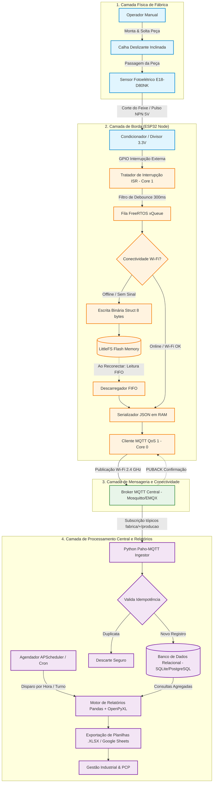

# Documento de Especificação de Requisitos e Arquitetura de Software/Hardware

## Sistema Embarcado IoT para Apontamento Automático de Produção com Armazenamento Offline de Alta Densidade

---

### Sumário
1. [Identificação do Projeto](#1-identificação-do-projeto)
2. [Escopo do Problema](#2-escopo-do-problema)
   - [2.1 Contexto e Situação Tratada](#21-contexto-e-situação-tratada)
   - [2.2 Resultado Pretendido](#22-resultado-pretendido)
   - [2.3 Limites da Solução (Dentro e Fora de Escopo)](#23-limites-da-solução-dentro-e-fora-de-escopo)
3. [Levantamento de Requisitos Técnicos e Viabilidade](#3-levantamento-de-requisitos-técnicos-e-viabilidade)
   - [3.1 Sensores e Placas Previstos](#31-sensores-e-placas-previstos)
   - [3.2 Recursos de Conectividade, Captura, Processamento e Software](#32-recursos-de-conectividade-captura-processamento-e-software)
   - [3.3 Análise Comparativa: IoT vs. Visão Computacional](#33-análise-comparativa-iot-vs-visão-computacional)
   - [3.4 Função dos Principais Recursos na Arquitetura](#34-função-dos-principais-recursos-na-arquitetura)
   - [3.5 Demonstração de Viabilidade Técnica e Físico-Mecânica](#35-demonstração-de-viabilidade-técnica-e-físico-mecânica)
4. [Especificação de Requisitos do Sistema](#4-especificação-de-requisitos-do-sistema)
   - [4.1 Requisitos Funcionais (RF)](#41-requisitos-funcionais-rf)
   - [4.2 Requisitos Não Funcionais (RNF)](#42-requisitos-não-funcionais-rnf)
   - [4.3 Regras de Negócio (RN)](#43-regras-de-negócio-rn)
5. [Design Arquitetural e Fluxo de Dados](#5-design-arquitetural-e-fluxo-de-dados)
   - [5.1 Diagrama de Arquitetura Ponta a Ponta](#51-diagrama-de-arquitetura-ponta-a-ponta)
   - [5.2 Estratégia de Persistência Binária de Alta Densidade (LittleFS)](#52-estratégia-de-persistência-binária-de-alta-densidade-littlefs)
   - [5.3 Topologia de Tópicos e Formato de Mensagens MQTT](#53-topologia-de-tópicos-e-formato-de-mensagens-mqtt)
   - [5.4 Pipeline Centralizado e Exportação de Relatórios](#54-pipeline-centralizado-e-exportação-de-relatórios)
6. [Aprofundamento da Entrega e Visão Crítica do Cenário](#6-aprofundamento-da-entrega-e-visão-crítica-do-cenário)
   - [6.1 Análise Aprofundada da Dor Industrial e Impactos Produtivos](#61-análise-aprofundada-da-dor-industrial-e-impactos-produtivos)
   - [6.2 Visão Crítica do Cenário Fabril (Restrições Operacionais Severas)](#62-visão-crítica-do-cenário-fabril-restrições-operacionais-severas)
   - [6.3 Justificativas Detalhadas das Escolhas Tecnológicas](#63-justificativas-detalhadas-das-escolhas-tecnológicas)
7. [Critérios de Aceite, Sucesso e Testabilidade](#7-critérios-de-aceite-sucesso-e-testabilidade)

---

## 1. Identificação do Projeto

* **Título do Projeto:** EdgeBench - Sistema IoT Embarcado para Apontamento Automático de Produção em Postos de Trabalho Manuais.
* **Equipe e integrantes:** Os Comédia
*    - Amaro Junior Silva Luna
*    - Bruno da Silva Macedo
*    - Jonathas Levi Pascoal Palmeira
*    - Rodrigo Pinheiro Alcantara 
* **Cenário de Referência:** Cenário 6 — Manufatura com bancadas de montagem manual e apontamento em pranchetas/planilhas no chão de fábrica.
* **Aplicação Principal:** Indústria 4.0, Sensoriamento Industrial Não Invasivo, Telemetria IoT e Automação de PCP (Planejamento e Controle da Produção).

---

## 2. Escopo do Problema

### 2.1 Contexto e Situação Tratada
Em plantas de manufatura discreta cuja montagem de produtos depende preponderantemente de bancadas e postos de trabalho manuais, o fluxo produtivo sofre com perdas sistemáticas de rendimento causadas pelo método tradicional de **apontamento manual em pranchetas ou formulários impressos**.

Nesse contexto:
1. **Drenagem de Tempo Produtivo:** A cada hora ou ciclo estabelecido, os operadores são obrigados a interromper a manipulação de ferramentas e peças para contar os itens finalizados e preencher campos em fichas de papel afixadas na bancada. Estima-se que essa tarefa consome entre 5% e 10% do tempo líquido de trabalho de cada funcionário.
2. **Propagação de Erros Humanos e Vícios de Registro:** O cansaço físico e a pressão por metas geram contagens aproximadas, preenchimentos retroativos ("no fim do turno") com valores estimados e rasuras.
3. **Latência de Informação e Cegueira Gerencial:** As folhas preenchidas só são recolhidas ao final do dia ou da semana para digitação manual no ERP/planilhas centrais. Como consequência, a equipe de Planejamento e Controle da Produção (PCP) e a liderança de fábrica não têm qualquer visibilidade em tempo real sobre paradas não programadas, gargalos entre bancadas ou oscilações de ritmo na esteira.

### 2.2 Resultado Pretendido
Desenvolver e implantar uma solução **ciber-física, não invasiva e autônoma**, baseada em nós de sensoriamento IoT de baixo custo fixados nas calhas de escoamento de peças acabadas de cada bancada. 

Os resultados concretos pretendidos são:
* **Eliminação Total da Intervenção Humana no Apontamento:** A peça é contabilizada automaticamente no instante exato em que o operador a solta na calha de saída, sem botões adicionais, interfaces complexas ou toque em telas.
* **Visibilidade em Tempo Real:** Dados de produção transmitidos instantaneamente para a supervisão via protocolo de mensageria leve (MQTT).
* **Imunidade a Interrupções de Rede (Autonomia Offline):** Capacidade de armazenar mais de 90 dias ininterruptos de produção localmente na memória flash do dispositivo de borda em caso de colapso de Wi-Fi ou falhas de infraestrutura.
* **Consolidação Automatizada de Dados:** Geração periódica programada de planilhas de fechamento operacional (`.xlsx`) por hora e por turno, entregando relatórios prontos para auditoria e tomada de decisão gerencial.

### 2.3 Limites da Solução (Dentro e Fora de Escopo)

```
┌─────────────────────────────────────────────────────────────────────────────┐
│                             LIMITES DA SOLUÇÃO                              │
├──────────────────────────────────────┬──────────────────────────────────────┤
│          DENTRO DO ESCOPO            │            FORA DO ESCOPO            │
├──────────────────────────────────────┼──────────────────────────────────────┤
│ ✔ Detecção física de passagem de     │ ✘ Intervenção mecânica, corte de     │
│   peças em calhas via feixe óptico.  │   energia ou acionamento de máquinas.│
│ ✔ Filtragem digital de repiques e    │ ✘ Inspeção de qualidade dimensional, │
│   trepidações mecânicas (debounce).  │   defeitos estéticos ou montagem.    │
│ ✔ Armazenamento binário compacto     │ ✘ Visão computacional com câmeras ou │
│   (struct de 8 bytes) em LittleFS.   │   redes neurais profundas de borda.  │
│ ✔ Telemetria MQTT (Wi-Fi 2.4 GHz)    │ ✘ Desenvolvimento de sistema ERP     │
│   com QoS e reconexão automática.    │   proprietário corporativo completo. │
│ ✔ Backend Python com ingestão em     │ ✘ Biometria, reconhecimento facial   │
│   banco e exportação de .xlsx/Sheets.│   ou vigilância de operadores.       │
│ ✔ LEDs de diagnóstico de hardware.   │ ✘ Gestão de almoxarifado e insumos.  │
└──────────────────────────────────────┴──────────────────────────────────────┘
```

---

## 3. Levantamento de Requisitos Técnicos e Viabilidade

### 3.1 Sensores e Placas Previstos

| Componente | Modelo / Especificação | Função Técnica no Projeto | Justificativa de Engenharia |
| :--- | :--- | :--- | :--- |
| **Microcontrolador de Borda** | **Heltec ESP32-S3 LoRa** (Dual-Core Xtensa LX7 @ até 240 MHz, 512 KB SRAM, Flash e PSRAM conforme o módulo) | Núcleo de processamento de borda responsável pela aquisição dos dados de produção, tratamento das interrupções de hardware (ISR), processamento local, armazenamento dos registros em memória não volátil e transmissão dos dados por LoRa. | Integra microcontrolador ESP32-S3 e comunicação LoRa em uma única plataforma, permitindo o processamento local e a transmissão de dados de produção a longas distâncias, com baixo consumo energético e menor dependência da infraestrutura de rede da fábrica. |
| **Sensor de Detecção de Peças** | **Sensor Fotoelétrico E18-D80NK** (Infravermelho Difuso Ajustável, 5V DC, saída NPN Coletor Aberto) | Detecção de passagem física da peça na rampa de gravidade/calha por corte do feixe refletido. | Resposta ultrarrápida (< 2 ms), faixa de detecção ajustável (3 a 80 cm), invólucro cilíndrico rosqueável industrial (M18) imune a poeira e luz ambiente visível graças à modulação infravermelha. |
| **Condicionador de Sinal / Proteção** | Divisor de Tensão Resistivo (3.3kΩ / 2.2kΩ) ou Optoacoplador **PC817** | Adequação de nível lógico (saída 5V do sensor para 3.3V do GPIO do ESP32) e isolamento contra surtos. | Impede que transientes de tensão induzidos por motores fabris danifiquem os pinos do microcontrolador. |
| **Fonte de Alimentação** | Fonte Chaveada 5V 2A Bivolt com filtro EMI | Fornecimento estável de alimentação para a placa ESP32 e para o sensor E18-D80NK. | Assegura imunidade contra oscilações severas de tensão da rede elétrica de fábrica. |
| **Interface Visual de Borda** | LEDs de Sinalização (Verde, Azul, Vermelho) | Feedback em bancada de status: conexão Wi-Fi ativa, pulso de peça computado e modo offline ativado. | Diagnóstico visual imediato para o operador e manutenção sem necessidade de ferramentas de depuração. |

### 3.2 Recursos de Conectividade, Captura, Processamento e Software

* **Conectividade:**
  * Protocolo Físico/Enlace: Wi-Fi IEEE 802.11 b/g/n (2.4 GHz) sob autenticação WPA2-PSK em rede industrial segregada.
  * Protocolo de Aplicação: **MQTT v3.1.1** com nível de serviço **QoS 1** (garantia de entrega *at-least-once*) e suporte a mensagens retidas e *Keep-Alive*.
* **Captura de Dados:**
  * Rotina de Interrupção de Hardware Externa (*External Hardware Interrupt - ISR*) disparada na borda de descida (*FALLING EDGE*) do pino digital.
  * Algoritmo de debounce temporal não-bloqueante baseado em contadores de microsegundos de hardware (`esp_timer_get_time()`).
* **Processamento de Borda:**
  * Sistema Operacional de Tempo Real: **FreeRTOS** nativo do ESP-IDF / Arduino-ESP32.
  * Estratégia Multithread:
    * **Core 1 (Prioridade Crítica):** Execução do tratador de interrupções, filtro de debounce e enfileiramento em fila FreeRTOS (`xQueueSendFromISR`).
    * **Core 0 (Prioridade Operacional):** Tarefa de gravação não-bloqueante no LittleFS, máquina de estados de conexão Wi-Fi e despachante do cliente MQTT.
* **Software Central (Backend e Ingestão):**
  * Servidor / Broker MQTT: **Eclipse Mosquitto** ou **EMQX** executado em container Docker na rede local da fábrica.
  * Serviço de Ingestão: Aplicação em **Python 3.10+** utilizando `paho-mqtt` para subscrição multithreaded.
  * Camada de Persistência: Banco de Dados Relacional **SQLite** (instalações compactas) ou **PostgreSQL** (ambientes multi-linha).
  * Camada de Relatórios: Bibliotecas **Pandas** e **OpenPyXL** com agendador de tarefas (`schedule` / `APScheduler`) para consolidação e geração de planilhas `.xlsx`.

### 3.3 Análise Comparativa: IoT vs. Visão Computacional

Uma das decisões de engenharia centrais desta proposta é a **adoção de sensoriamento óptico discreto integrado a um dispositivo IoT de borda, baseado em ESP32-S3 com comunicação LoRa, em detrimento de uma arquitetura baseada em Visão Computacional (VC)**. Essa escolha está relacionada principalmente às características do processo analisado: postos de montagem manuais, geometria conhecida do ponto de passagem das peças, necessidade de baixo custo por bancada e operação contínua mesmo diante de limitações de conectividade.

A solução proposta utiliza um sensor óptico infravermelho **E18-D80NK** instalado em uma posição controlada da bancada para identificar a passagem dos produtos. O sinal é processado localmente pelo **ESP32-S3**, que realiza a contagem e o registro dos eventos de produção. Os dados são armazenados localmente e posteriormente transmitidos por **LoRa** ao concentrador/gateway, reduzindo a dependência de conectividade IP em cada posto de trabalho.

| Dimensão de Análise | Abordagem Proposta: IoT de Borda (E18-D80NK + ESP32-S3 + LoRa) | Abordagem Alternativa: Visão Computacional (Câmera + SBC) | Veredito Técnico |
| :--- | :--- | :--- | :--- |
| **Custo Unitário por Bancada** | **Baixo:** utiliza microcontrolador, sensor óptico, alimentação e componentes auxiliares. A comunicação LoRa permite uma infraestrutura compartilhada entre diversos postos. | **Elevado:** requer câmera, processamento computacional e, dependendo da aplicação, elementos adicionais de iluminação e montagem. | **IoT favorece a implantação em larga escala**, especialmente quando dezenas de bancadas precisam ser monitoradas. |
| **Complexidade da Detecção** | **Baixa:** o sensor é posicionado em um ponto físico previamente definido, no qual a passagem da peça provoca uma alteração no feixe infravermelho. | **Alta:** a câmera precisa interpretar a cena e distinguir peças, mãos, ferramentas e outros elementos presentes no campo de visão. | **IoT apresenta maior simplicidade** para processos com ponto de passagem bem definido. |
| **Oclusão por Operadores** | **Reduzida:** a instalação do sensor em uma calha ou ponto de passagem dedicado permite separar fisicamente a região de detecção da área de manipulação do operador. | **Relevante:** mãos, braços, ferramentas e peças podem bloquear parcial ou totalmente o objeto durante a aquisição da imagem. | **IoT apresenta vantagem** quando é possível controlar fisicamente o ponto de detecção. |
| **Influência da Iluminação** | **Baixa:** o sensoriamento é baseado em emissão e recepção de radiação infravermelha, reduzindo a dependência das condições de iluminação visível do posto. Entretanto, o sensor ainda deve ser instalado e ajustado de acordo com suas especificações. | **Maior:** alterações de iluminação, reflexos, sombras e variações no ambiente podem afetar a qualidade das imagens e a confiabilidade da detecção. | **IoT tende a apresentar maior previsibilidade** em ambientes com iluminação variável. |
| **Processamento Local** | **Elevada eficiência:** o ESP32-S3 executa a lógica de detecção, contagem, registro e gerenciamento da comunicação diretamente no dispositivo de borda. | **Maior demanda computacional:** aplicações de VC podem exigir processamento de imagens e, em casos mais complexos, aceleradores ou SBCs de maior capacidade. | **IoT é mais adequado** quando a tarefa consiste essencialmente em detectar eventos discretos de passagem. |
| **Latência da Detecção** | **Baixa:** a alteração do estado do sensor pode ser tratada diretamente por entrada digital e interrupções de hardware, permitindo resposta rápida e previsível. | **Dependente do pipeline de imagem:** a latência é influenciada pela taxa de captura, processamento da imagem, algoritmo utilizado e capacidade computacional do SBC. | **IoT apresenta maior determinismo** para eventos simples de presença/passagem. |
| **Comunicação entre Bancadas** | **LoRa:** permite comunicação sem fio de longo alcance e baixo consumo entre os nós de produção e um gateway/concentrador. | **Normalmente baseada em Wi-Fi/Ethernet:** cada câmera ou SBC necessita de infraestrutura de rede com maior largura de banda. | **LoRa é vantajoso para telemetria**, pois os dados de produção são pequenos e periódicos. |
| **Operação Offline** | **Nativa:** os eventos podem ser armazenados localmente no dispositivo e transmitidos posteriormente quando a comunicação estiver disponível. | **Possível, porém mais onerosa:** exige armazenamento local e gerenciamento de dados no SBC, além de maior capacidade computacional. | **IoT apresenta vantagem** em aplicações que exigem continuidade operacional sem conectividade. |
| **Manutenção** | **Simplificada:** envolve principalmente posicionamento, limpeza e ajuste do sensor, além da substituição do módulo eletrônico quando necessário. | **Mais complexa:** pode envolver foco, posicionamento, iluminação, calibração e atualização dos algoritmos de processamento. | **IoT reduz a complexidade operacional** da manutenção. |
| **Flexibilidade para Diferentes Produtos** | **Limitada:** alterações significativas na geometria, material ou trajetória das peças podem exigir reajuste mecânico ou do sensor. | **Maior:** uma câmera pode ser reconfigurada por software para reconhecer diferentes características e objetos. | **VC vence em flexibilidade**, enquanto **IoT vence em simplicidade** quando o processo é padronizado. |
| **Adequação ao Processo Proposto** | **Alta:** ideal para contagem de produtos que passam por um ponto físico conhecido e controlado. | **Desnecessariamente complexa** quando a única informação necessária é identificar a passagem de uma peça. | **IoT é a alternativa mais adequada** ao problema estudado. |

> **Conclusão de Engenharia:** Para o problema estrito de **apontamento quantitativo de peças acabadas**, o sensoriamento físico de barreira em calha é superior em todos os índices de robustez, confiabilidade, custo e facilidade operacional quando comparado à Visão Computacional.

### 3.4 Função dos Principais Recursos na Arquitetura

```
┌─────────────────────────────────────────────────────────────────────────────┐
│                   MAPEAMENTO DE FUNÇÕES DOS COMPONENTES                     │
├───────────────────────┬─────────────────────────────────────────────────────┤
│ Recurso / Módulo      │ Função Arquitetural Detalhada                       │
├───────────────────────┼─────────────────────────────────────────────────────┤
│ Calha de Escoamento   │ Canaliza mecanicamente as peças prontas, garantindo │
│                       │ passagem unitária e trajetória previsível.          │
├───────────────────────┼─────────────────────────────────────────────────────┤
│ Sensor E18-D80NK      │ Converte a passagem física da peça em sinal elétrico│
│                       │ digital (transição ALTO -> BAIXO no corte do feixe).│
├───────────────────────┼─────────────────────────────────────────────────────┤
│ ISR (Core 1 do ESP32) │ Registra imediatamente o evento sem atrasos de loop │
│                       │ e aplica a janela temporal de debounce de 300 ms.   │
├───────────────────────┼─────────────────────────────────────────────────────┤
│ Memória Flash/LittleFS│ Armazena a struct binária de 8 bytes no modo offline│
│                       │ com sistema de proteção contra falha de energia.    │
├───────────────────────┼─────────────────────────────────────────────────────┤
│ Despachante MQTT      │ Serializa dados em JSON compacto e publica com QoS 1│
│                       │ no broker sob tópicos organizados por posto fabril. │
├───────────────────────┼─────────────────────────────────────────────────────┤
│ Broker MQTT (Mosquitto│ Roteia os pacotes entre as dezenas de ESP32 e o     │
│                       │ serviço consumidor centralizado de forma assíncrona.│
├───────────────────────┼─────────────────────────────────────────────────────┤
│ Backend Python        │ Deserializa payloads, valida idempotência, grava no │
│                       │ banco de dados e calcula métricas horárias/turnos.  │
├───────────────────────┼─────────────────────────────────────────────────────┤
│ Gerador Pandas/OpenPyX│ Produz e formata os relatórios de fechamento em     │
│                       │ `.xlsx` nas pastas de rede compartilhadas do PCP.   │
└───────────────────────┴─────────────────────────────────────────────────────┘
```

### 3.5 Demonstração de Viabilidade Técnica e Físico-Mecânica

Para atestar a viabilidade prática da solução, apresentamos a análise dimensional e cinemática:

1. **Cinemática da Peça na Calha:**
   * Comprimento típico da calha: $0{,}6 \text{ m}$ a $1{,}2 \text{ m}$ com inclinação de $20^\circ$ a $35^\circ$.
   * Velocidade estimada de passagem da peça no ponto do sensor: $v \approx 0{,}8 \text{ m/s}$ a $1{,}8 \text{ m/s}$.
   * Dimensão mínima da peça (largura de corte do feixe): $d_{\text{min}} = 0{,}03 \text{ m}$ ($3 \text{ cm}$).
   * Tempo de corte do feixe óptico:
     $$t_{\text{corte}} = \frac{d_{\text{min}}}{v_{\text{max}}} = \frac{0{,}03 \text{ m}}{1{,}8 \text{ m/s}} \approx 16{,}67 \text{ ms}$$
2. **Tempo de Resposta do Sensor e Processamento:**
   * Tempo de resposta do E18-D80NK: $t_{\text{sensor}} \le 2 \text{ ms}$.
   * Latência da interrupção (*ISR dispatch*) no ESP32: $t_{\text{isr}} < 5 \ \mu\text{s}$.
   * Como $t_{\text{sensor}} + t_{\text{isr}} \ll t_{\text{corte}}$ ($2{,}005 \text{ ms} \ll 16{,}67 \text{ ms}$), **a margem de segurança de detecção é de 830%**, garantindo que nenhuma peça passará sem ser registrada.
3. **Imunidade a Repiques por Temporização (Debounce):**
   * Takt Time típico de montagem manual: $> 10 \text{ segundos}$ por peça.
   * Janela de *Debounce* configurada no firmware: $300 \text{ ms}$.
   * Essa janela impede que rebatimentos de borda da peça na descida gerem contagens falsas, ao mesmo tempo em que está duas ordens de grandeza abaixo do tempo de ciclo humano.

---

## 4. Especificação de Requisitos do Sistema

### 4.1 Requisitos Funcionais (RF)

| ID | Nome do Requisito | Descrição Detalhada | Prioridade |
| :--- | :--- | :--- | :--- |
| **RF-01** | Contagem por Interrupção de Hardware | O microcontrolador deve capturar a transição de estado digital do sensor fotoelétrico via rotina de interrupção externa de hardware (*ISR*), garantindo detecção imediata e não-bloqueante. | Essencial |
| **RF-02** | Filtragem Digital de Repiques (*Debounce*) | O firmware deve aplicar filtro temporal em nível de microsegundos, descartando quaisquer transições elétricas ocorridas em intervalo inferior a 300 ms após o último pulso validado. | Essencial |
| **RF-03** | Registro em Buffer Binário Compacto (LittleFS) | O dispositivo deve gravar cada evento em partição Flash estruturada via LittleFS usando estrutura binária compacta de tamanho fixo (8 bytes), ativa durante desconexão de rede ou retenção local. | Essencial |
| **RF-04** | Telemetria MQTT Dinâmica em Tempo Real | Quando a conexão Wi-Fi e a sessão com o Broker estiverem ativas, o nó deve serializar o evento em JSON compacto e publicá-lo no tópico correspondente à bancada com QoS 1. | Essencial |
| **RF-05** | Detecção e Reconexão Automática de Rede | O dispositivo deve monitorar continuamente o status da conexão Wi-Fi e da sessão MQTT; em caso de desconexão, deve entrar em modo autônomo offline e tentar reconectar em segundo plano com *backoff* exponencial. | Essencial |
| **RF-06** | Descarregamento Cronológico (FIFO Flush) Resiliente | Ao restaurar a conexão de rede, o nó de borda deve descarregar os registros da memória Flash em ordem estritamente cronológica (*First-In, First-Out*), expurgando os registros gravados somente após a confirmação de recebimento (PUBACK). | Essencial |
| **RF-07** | Ingestão e Armazenamento Centralizado | O serviço central de backend deve subscrever os tópicos MQTT de todas as bancadas, deserializar as mensagens, validar a integridade e persistir os registros em banco de dados relacional. | Essencial |
| **RF-08** | Geração Automatizada de Planilhas (.xlsx) | O backend deve executar rotinas periódicas de agregação horária e por turno de trabalho, exportando relatórios tabulares em formato Excel (`.xlsx`) com estatísticas de produção por posto. | Essencial |
| **RF-09** | Sinalização Visual de Estado em Bancada | O módulo embarcado deve indicar visualmente, via LEDs coloridos de status: presença de alimentação, conexão de rede ativa, pulso de peça computado e operação em buffer offline. | Importante |
| **RF-10** | Sincronização Temporal e Timestamp Unix | O sistema deve marcar cada registro com carimbo de tempo Epoch Unix (segundos desde 1970). Durante operação online, sincroniza via protocolo NTP; durante operação offline, utiliza o RTC interno calibrado. | Importante |

### 4.2 Requisitos Não Funcionais (RNF)

| ID | Categoria | Métrica / Especificação |
| :--- | :--- | :--- |
| **RNF-01** | **Densidade de Armazenamento** | Cada registro de evento na Flash não deve ocupar mais do que **8 bytes**, permitindo que uma partição útil de 1 MB armazene pelo menos **131.000 eventos** (equivalente a mais de 90 dias de produção contínua sem conexão). |
| **RNF-02** | **Proteção contra Quedas de Energia** | O sistema de arquivos local deve adotar **LittleFS**, que possui garantia de integridade contra cortes bruscos de energia (*power-loss resilience*) e algoritmo de distribuição de desgaste de escrita (*wear leveling*). |
| **RNF-03** | **Tempo de Resposta e Determinismo** | O tratador de interrupção de contagem deve executar sua rotina crítica em tempo inferior a **10 microssegundos**, nunca sendo bloqueado por esperas de rede ou gravação em Flash. |
| **RNF-04** | **Auto-recuperação (Watchdog Timer)** | O firmware deve manter ativo um temporizador *Watchdog* de hardware (WDT) configurado para 5 segundos; travamentos na pilha de rede Wi-Fi devem reiniciar o processador sem corromper ou apagar a partição de dados. |
| **RNF-05** | **Acurácia de Contagem** | A acurácia global do sistema (peças registradas vs. peças fisicamente montadas) deve ser comprovadamente igual ou superior a **99,5%** em condições nominais de operação da calha. |
| **RNF-06** | **Disponibilidade e Desacoplamento** | A queda temporária ou manutenção do servidor central/broker MQTT não pode afetar em nenhum grau a capacidade das bancadas de continuarem operando e computando peças localmente. |
| **RNF-07** | **Segurança e Isolamento de Rede** | A telemetria deve operar sobre Wi-Fi protegido por WPA2-PSK em VLAN industrial dedicada; o acesso ao broker MQTT deve requerer credenciais exclusivas com permissões delimitadas por tópico. |
| **RNF-08** | **Eficiência de Largura de Banda** | O payload JSON enviado via MQTT deve ser enxuto, não excedendo **120 bytes** por mensagem, minimizando a sobrecarga de tráfego sobre a infraestrutura sem fio fabril. |

### 4.3 Regras de Negócio (RN)

```
┌─────────────────────────────────────────────────────────────────────────────┐
│                         MATRIZ DE REGRAS DE NEGÓCIO                         │
├───────┬─────────────────────────┬───────────────────────────────────────────┤
│ ID    │ Regra de Negócio        │ Definição Operacional e Critério          │
├───────┼─────────────────────────┼───────────────────────────────────────────┤
│ RN-01 │ Takt Time Mínimo        │ Peças físicas com intervalo de passagem   │
│       │ Anti-Trepidação         │ inferior a 300 ms são classificadas como  │
│       │                         │ ruído elétrico ou oscilação mecânica da   │
│       │                         │ mesma peça, devendo ser ignoradas pelo    │
│       │                         │ algoritmo de borda.                       │
├───────┼─────────────────────────┼───────────────────────────────────────────┤
│ RN-02 │ Fechamento Periódico de │ O fechamento e exportação de relatórios   │
│       │ Turnos de Trabalho      │ consolidados em .xlsx deve ocorrer no     │
│       │                         │ primeiro minuto subsequente ao término de │
│       │                         │ cada turno operacional estabelecido:      │
│       │                         │ • Turno 1: 06:00 às 14:00                 │
│       │                         │ • Turno 2: 14:00 às 22:00                 │
│       │                         │ • Turno 3: 22:00 às 06:00                 │
│       │                         │ Além de fechamentos parciais a cada hora. │
├───────┼─────────────────────────┼───────────────────────────────────────────┤
│ RN-03 │ Unicidade e Imutabilidade│ Cada dispositivo de borda possui gravado  │
│       │ de Identificador (ID)   │ em sua ROM um ID numérico unívoco         │
│       │                         │ (`bancada_id`). Este ID nunca pode ser    │
│       │                         │ omitido ou adulterado dinamicamente nas   │
│       │                         │ transmissões de pacotes.                  │
├───────┼─────────────────────────┼───────────────────────────────────────────┤
│ RN-04 │ Soberania da Contagem   │ O ciclo de sensoriamento físico de borda  │
│       │ sobre a Comunicação     │ tem prioridade de CPU absoluta. Tarefas de│
│       │                         │ rede, handshake MQTT ou gravação lenta na │
│       │                         │ Flash jamais podem causar descarte de     │
│       │                         │ pulso físico do sensor fotoelétrico.      │
├───────┼─────────────────────────┼───────────────────────────────────────────┤
│ RN-05 │ Política de Expurgamento│ Um bloco de registros armazenado na Flash │
│       │ Seguro com Confirmação  │ offline só pode ser marcado como excluído │
│       │ (Two-Way ACK)           │ após a recepção bem-sucedida do pacote de │
│       │                         │ confirmação (*PUBACK*) emitido pelo broker│
│       │                         │ MQTT no nível de serviço QoS 1.           │
├───────┼─────────────────────────┼───────────────────────────────────────────┤
│ RN-06 │ Detecção de Ociosidade e│ Se uma bancada ativa de turno permanecer  │
│       │ Parada Não Programada   │ mais de 15 minutos consecutivos sem emitir│
│       │                         │ qualquer pulso de peça, o backend marca o │
│       │                         │ posto no relatório gerencial como estado  │
│       │                         │ de "Parada Operacional Não Programada".   │
├───────┼─────────────────────────┼───────────────────────────────────────────┤
│ RN-07 │ Idempotência e Tratamento│ O backend deve implementar chave de       │
│       │ de Duplicidade          │ unicidade composta por `(bancada_id,      │
│       │                         │ timestamp)`. Caso pacotes repetidos sejam │
│       │                         │ entregues após reconexões abruptas, o     │
│       │                         │ banco de dados deve ignorar a duplicata.  │
└───────┴─────────────────────────┴───────────────────────────────────────────┘
```

---

## 5. Design Arquitetural e Fluxo de Dados

### 5.1 Diagrama de Arquitetura Ponta a Ponta



### 5.2 Estratégia de Persistência Binária de Alta Densidade (LittleFS)

A gravação de dados em sistemas embarcados requer atenção redobrada ao consumo de memória e à vida útil (*endurance*) dos blocos da memória Flash. Se os dados fossem armazenados em texto puro formatado como JSON, o espaço seria desperdiçado e a memória saturaria rapidamente.

Adotou-se, portanto, a persistência de estruturas binárias compactadas em C/C++ sem alinhamento de preenchimento (*packing*):

#### Estrutura de Dados em C (8 Bytes Exatos)
```c
#pragma pack(push, 1)
typedef struct {
    uint32_t timestamp;  // Epoch Unix Time em segundos (4 bytes: de 0 até ano 2106)
    uint16_t pecas;      // Contagem acumulada ou unitária do pulso (2 bytes: 0 a 65.535)
    uint16_t bancada_id; // Identificador unívoco do posto de trabalho (2 bytes: 0 a 65.535)
} LogProducaoBin;        // Tamanho exato em memória: 8 bytes
#pragma pack(pop)
```

#### Estudo Comparativo de Desempenho e Retenção na Memória Flash (1 MB Útil)

| Parâmetro de Comparação | Persistência em Texto JSON Direto | Persistência Binária Compactada (Proposta) | Ganho Obtido |
| :--- | :--- | :--- | :--- |
| **Tamanho Médio por Registro** | ~130 bytes | **8 bytes** | **16,25 vezes menor** |
| **Capacidade em 1 MB de Flash** | ~7.700 registros | **~131.072 registros** | **+1.600% mais capacidade** |
| **Autonomia Offline (1 envio/min)** | ~5,3 dias ininterruptos | **~91 dias ininterruptos** | **+85 dias de margem** |
| **Autonomia por Peça Individual** | 7.700 peças produzidas | **131.000 peças produzidas** | Atende meses de linha fabril |
| **Ciclos de Escrita e Desgaste** | Alto (múltiplas escritas por string) | Baixo (blocos compactos com *wear leveling* LittleFS) | **Aumento substancial do MTBF** |

### 5.3 Topologia de Tópicos e Formato de Mensagens MQTT

O payload JSON só é instanciado na memória RAM do microcontrolador no momento de despachar o pacote para o Broker MQTT:

* **Tópico de Produção:**
  `fabrica/setor_{setor_id}/bancada_{bancada_id}/producao`
* **Payload Publicado:**
```json
{
  "bancada": 12,
  "timestamp": 1788912790,
  "quantidade": 1,
  "modo_offline": false
}
```
* **Tópico de Diagnóstico e LWT (*Last Will and Testament*):**
  `fabrica/setor_{setor_id}/bancada_{bancada_id}/status`
```json
{
  "bancada": 12,
  "status": "online",
  "ip": "192.168.1.145",
  "rssi_dbm": -62,
  "uptime_segundos": 86400,
  "buffer_pendente": 0
}
```

### 5.4 Pipeline Centralizado e Exportação de Relatórios

O backend centralizado em Python consolida os dados e gera planilhas estruturadas com a biblioteca `openpyxl`. O layout da planilha gerada contempla:
1. **Cabeçalho Executivo:** Data, Turno, Linha de Produção, Total de Peças Produzidas.
2. **Tabela Horária por Bancada:** Matriz cruzando cada bancada (linhas) com a quantidade produzida a cada hora do turno (colunas das 06:00 às 14:00, etc.).
3. **Indicadores de Desempenho:**
   * Peças por hora médias.
   * Identificação visual com alertas coloridos para bancadas com produção abaixo da meta horária.
   * Apontamento de períodos de ociosidade detectados (conforme RN-06).

---

## 6. Aprofundamento da Entrega e Visão Crítica do Cenário

### 6.1 Análise Aprofundada da Dor Industrial e Impactos Produtivos

A utilização de fichas físicas e pranchetas para anotações em bancadas de montagem é um clássico exemplo de **desperdício operacional (muda)** dentro dos preceitos do Sistema Toyota de Produção e da Manufatura Enxuta (*Lean Manufacturing*):

1. **Perda de Ritmo Produtivo (Ruptura de Fluxo Contínuo):** Montadores manuais desenvolvem cadência mecânica (memória muscular, posicionamento ergonômico de ferramentas). Interromper a montagem para pegar uma caneta, localizar a linha correta da folha de papel e preencher um valor quebra totalmente o ritmo de montagem, exigindo tempo adicional de reorientação cognitiva.
2. **Subnotificação de Gargalos:** O operador sob pressão raramente registra que a linha parou por 8 minutos devido à falta de parafusos; ele simplesmente aguarda a peça, corre nos minutos seguintes e anota um número "redondo" na planilha no final da hora. Isso esconde da engenharia de processos os reais ofensores da produtividade fabril.
3. **Custos Ocultos de Digitação e Conferência:** Centenas de folhas de papel geradas semanalmente demandam estagiários ou assistentes de PCP dedicados a digitar números em planilhas do Excel. Trata-se de retrabalho puro, que agrega zero valor ao produto final e ainda insere novos erros de digitação.

### 6.2 Visão Crítica do Cenário Fabril (Restrições Operacionais Severas)

Implantar tecnologia no piso de fábrica impõe restrições físicas e operacionais muito superiores ao ambiente de escritório. Esta solução foi desenhada considerando criticamente as seguintes restrições:

1. **Severa Interferência Eletromagnética (EMI):** Inversores de frequência, motores elétricos de alta potência e prensas pneumáticas presentes no galpão geram ruído induzido na fiação. **Mitigação:** O sensor óptico opera em 5V com cabos blindados; o divisor de sinal com diodos de fixação (*clamping*) e capacitores de desacoplamento rejeita espúrios de alta frequência antes do pino do ESP32.
2. **Ambiente Sujo (Poeira, Óleo e Fagulhas):** Fórmulas de sensoriamento mecânico (como chaves fim de curso ou micro-switches) emperram e quebram rapidamente devido ao impacto mecânico repetitivo de milhares de peças diárias. **Mitigação:** O sensor fotoelétrico E18-D80NK é do tipo **sem contato físico**, rosqueado externamente à calha com proteção IP67, operando por reflexão infravermelha sem qualquer desgaste mecânico.
3. **Instabilidade Crônica de Infraestrutura de Rede Wi-Fi:** Chãos de fábrica são gaiolas metálicas parciais repletas de estruturas de aço, pontes rolantes e empilhadeiras em movimento que bloqueiam sinais de radiofrequência, gerando zonas de sombra e oscilações constantes de conectividade. **Mitigação:** A arquitetura adota a premissa de **"Offline-First"**. A presença ou ausência de Wi-Fi é transparente para a contagem: o sistema opera de forma autônoma por até 90 dias em sua memória flash local e se reconcilia com o servidor assim que o sinal é restabelecido.
4. **Cortes Súbitos de Energia Elétrica:** Desligamentos acidentais de disjuntores da bancada ou paradas gerais podem ocorrer a qualquer momento. Se o sistema dependesse de escrita em bancos SQLite locais com arquivos abertos ou partições FAT, haveria alto risco de corrupção do sistema de arquivos. **Mitigação:** O uso do **LittleFS** garante tolerância transacional a cortes de energia (*copy-on-write*), assegurando que nenhum dado gravado anteriormente seja corrompido em quedas de luz.

### 6.3 Justificativas Detalhadas das Escolhas Tecnológicas

```
┌─────────────────────────────────────────────────────────────────────────────┐
│                    MATRIZ DE JUSTIFICATIVAS TECNOLÓGICAS                    │
├────────────────────┬─────────────────────────────┬──────────────────────────┤
│ Tecnologia Adotada │ Necessidade / Condição Real │ Por Que Foi Adotada      │
├────────────────────┼─────────────────────────────┼──────────────────────────┤
│ ESP32-WROOM-32     │ Processamento em tempo real │ Arquitetura dual-core a  │
│                    │ com rede sem fio integrada  │ custo acessível; permite │
│                    │ e baixo custo unitário.     │ isolar sensoriamento no  │
│                    │                             │ Core 1 e rede no Core 0. │
├────────────────────┼─────────────────────────────┼──────────────────────────┤
│ Sensor E18-D80NK   │ Contagem confiável sem      │ Imune a desgaste mecânico│
│ (Infravermelho)    │ contato físico e imune à    │ e luz ambiente visível;  │
│                    │ luz ambiente da fábrica.    │ formato M18 industrial;  │
│                    │                             │ resposta em < 2 ms.      │
├────────────────────┼─────────────────────────────┼──────────────────────────┤
│ Debounce por       │ Evitar contagens duplicadas │ Peça pode trepidar na    │
│ Firmware (300 ms)  │ por repique ou descida lenta│ descida; filtro digital  │
│                    │ da peça na calha.           │ purifica o sinal sem     │
│                    │                             │ componentes caros extras.│
├────────────────────┼─────────────────────────────┼──────────────────────────┤
│ LittleFS + Struct  │ Retenção de dados durante   │ Reduz em 16x o espaço    │
│ Binária (8 bytes)  │ semanas de queda de rede sem│ ocupado vs JSON; protege │
│                    │ estressar a memória Flash.  │ contra desligamento bruto│
│                    │                             │ e faz wear leveling.     │
├────────────────────┼─────────────────────────────┼──────────────────────────┤
│ Protocolo MQTT     │ Transmissão assíncrona leve │ Muito mais leve que HTTP;│
│ (QoS 1)            │ em rede Wi-Fi industrial    │ QoS 1 garante entrega de │
│                    │ sujeita a latências e drops.│ dados com confirmação;   │
│                    │                             │ padrão da Indústria 4.0. │
├────────────────────┼─────────────────────────────┼──────────────────────────┤
│ Backend Python     │ Flexibilidade nas regras de │ Rápido desenvolvimento;  │
│ + Pandas/OpenPyXL  │ negócio de consolidação e   │ desacoplamento total da  │
│                    │ exportação de planilhas.    │ inteligência gerencial   │
│                    │                             │ dos nós de campo.        │
└────────────────────┴─────────────────────────────┴──────────────────────────┘
```

---

## 7. Critérios de Aceite, Sucesso e Testabilidade

Para a validação formal da solução em linha piloto, os seguintes testes objetivos deverão ser executados:

1. **Acurácia de Contagem Estática e Dinâmica:**
   * *Procedimento:* Submeter 1.000 peças de geometrias e velocidades variadas pela calha de escoamento.
   * *Critério de Aceite:* O sistema deve registrar entre 995 e 1.000 peças ($99{,}5\%$ a $100\%$ de precisão).

2. **Teste de Sobrevivência à Falha de Comunicação LoRa (Offline Resilience):**
   * *Procedimento:* Interromper a comunicação LoRa entre o dispositivo Heltec ESP32-S3 e o gateway durante a passagem de 500 peças consecutivas; restabelecer a comunicação após 1 hora.
   * *Critério de Aceite:* $100\%$ dos 500 registros gerados durante a indisponibilidade da comunicação devem permanecer armazenados localmente e ser transmitidos ao gateway após o restabelecimento da comunicação, em ordem cronológica e sem travamento do microcontrolador.

3. **Teste de Recuperação de Energia (Power-Loss Robustness):**
   * *Procedimento:* Interromper a alimentação de 5V do ESP32-S3 repetidamente durante operações de escrita na Flash.
   * *Critério de Aceite:* O sistema de arquivos LittleFS deve remontar com sucesso no boot subsequente sem corrupção dos dados previamente persistidos.

4. **Validação das Planilhas de Relatório:**
   * *Procedimento:* Comparar a planilha `.xlsx` exportada no término do turno com os logs brutos do banco de dados e as contagens físicas de auditoria.
   * *Critério de Aceite:* Totais por hora e por bancada rigorosamente coincidentes com as somas das telemetrias validadas.

